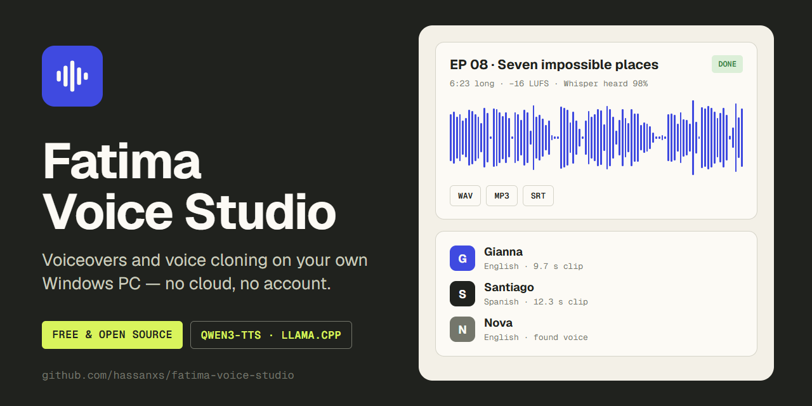
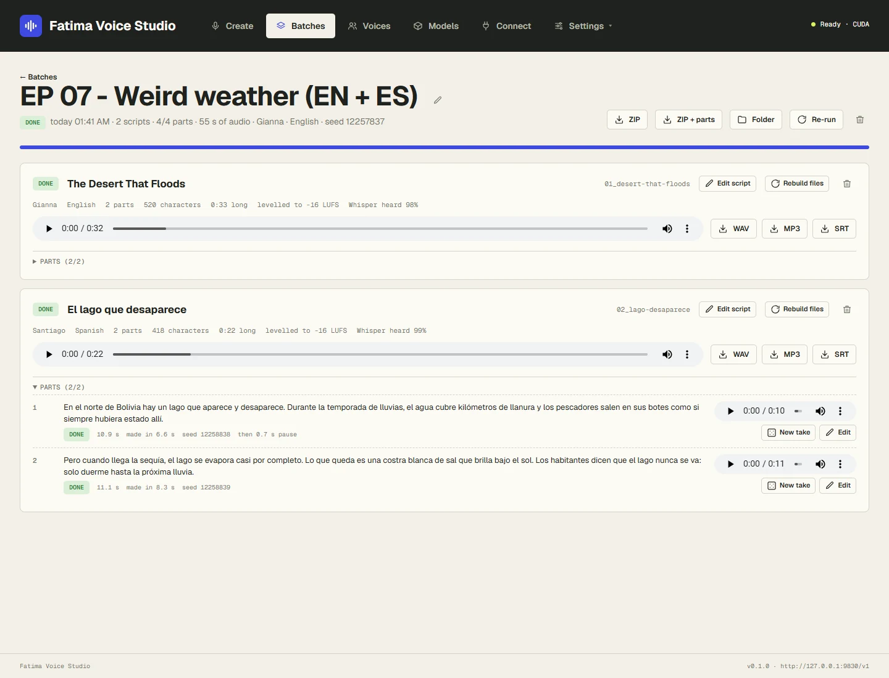
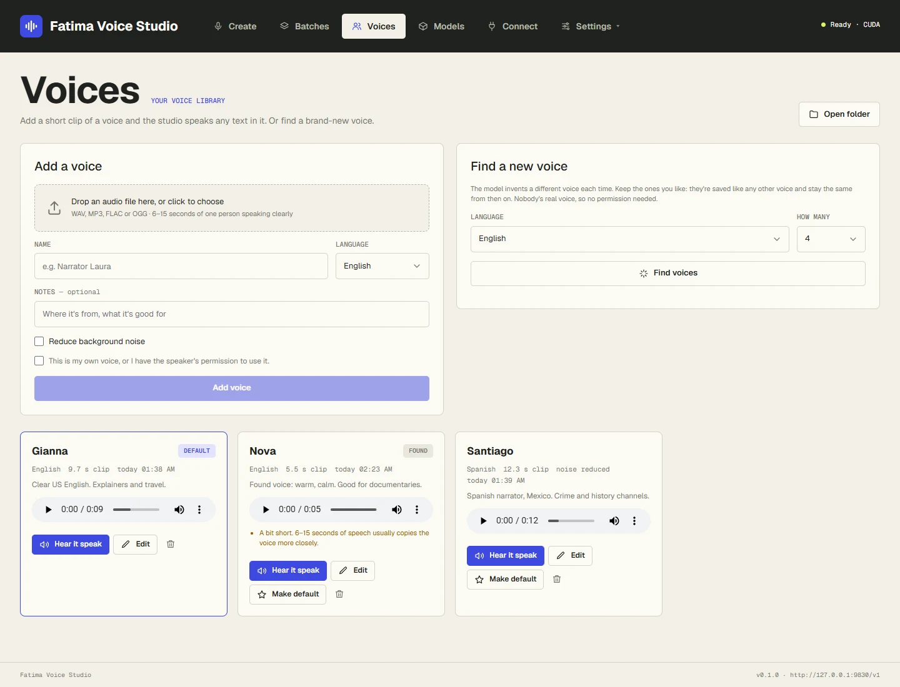
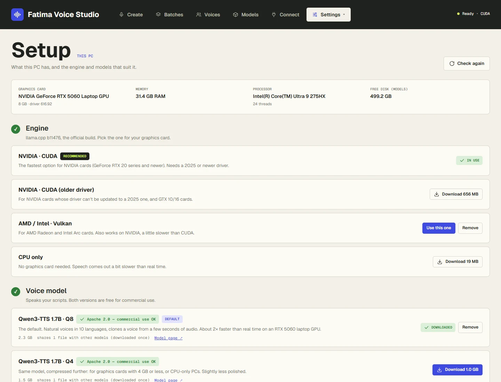
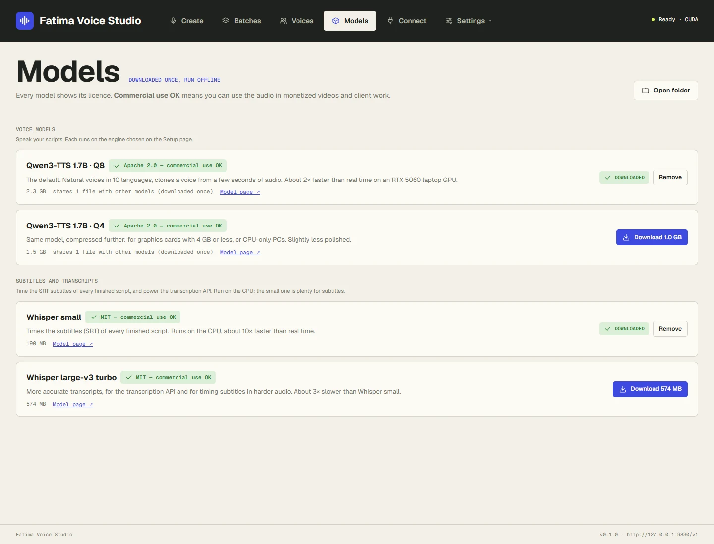

# Fatima Voice Studio

[](https://github.com/hassanxs/fatima-voice-studio/releases/latest) [](https://github.com/hassanxs/fatima-voice-studio/actions/workflows/release.yml) [](https://github.com/hassanxs/fatima-voice-studio/releases) [](LICENSE)  



Voiceovers and voice cloning on your own Windows PC: paste a script (or fifty), pick a voice from your library,
and get each one back as WAV and MP3 at YouTube loudness, with SRT subtitles, in its own named, renamable folder.
It runs [Qwen3-TTS](https://huggingface.co/Qwen/Qwen3-TTS-12Hz-1.7B-Base) locally through the official
[llama.cpp](https://github.com/ggml-org/llama.cpp) engine: no cloud, no account, no per-minute cost, and the
voice model is free for commercial use. It also works as an OpenAI-compatible speech API and as an MCP server
for AI agents (Claude Code, Codex, Antigravity, Hermes…).

On a laptop RTX 5060 (8 GB) it speaks about **2.2× faster than real time**: a 10-minute voiceover takes about
5 minutes, subtitles included. It also runs on AMD and Intel graphics cards (Vulkan) and, more slowly, on the CPU.

The sibling of [Fatima Image Studio](https://github.com/hassanxs/Fatima-Image-Studio).


## Screenshots

| Batches | One batch |
|---|---|
|  |  |
| **Voices** | **Setup** |
|  |  |
| **Models** | **Hear it** |
|  | [English sample](docs/samples/english-nova.mp3) (18 s) · [Spanish sample](docs/samples/spanish-lucia.mp3) (17 s)<br><br>Both made in the app on a laptop RTX 5060, with *found* voices (voices the model invented, nobody's real voice), levelled to −16 LUFS. |

## Download and install

Get `FatimaVoiceStudio-Setup-<version>.exe` from the
[latest release](https://github.com/hassanxs/fatima-voice-studio/releases/latest) and run it. It installs for
your Windows user only (no admin prompt) and is small, because the engine and models aren't bundled: the app
downloads the ones that suit your PC on its **Setup** page, which opens by itself the first time (about 2.9 GB
in all on an NVIDIA PC: engine 580 MB, voice model 2.3 GB, subtitles model 190 MB).

The installer isn't code-signed yet, so Windows SmartScreen may say "Windows protected your PC". Choose
**More info → Run anyway**. Each release lists the installer's SHA-256, and the installer is built by GitHub
Actions from the tagged source.

**Updates:** the installed app checks GitHub for a new release when it starts and every 6 hours, and shows it
under **Settings → Updates**. *Quick update* replaces only the app's own files; *Full update* runs the new
installer. Both check the download's SHA-256 and keep your voices, models, settings and audio.

**Uninstall** from Windows Settings → Apps. It asks whether to also delete the downloaded models, engine and
settings; your voice library and your audio are always kept.

**System requirements:** Windows 10 or 11 (64-bit). Best on an NVIDIA GeForce RTX card with 4 GB or more; AMD
and Intel cards work through Vulkan, and CPU-only works at about 0.7× real time. 8 GB of RAM and 4 GB of free
disk.

## Start

Start **Fatima Voice Studio** from the Start menu. It runs in the background with a tray icon and opens
http://127.0.0.1:9830/ in your browser. Starting it again while it runs just opens the page.

Tray menu: open, copy API URL / key, open batches folder, *Start with Windows*, quit. The dot on the tray icon
shows what it's doing: none = ready, amber = speaking or writing files, red = engine problem. A Windows
notification says when a batch is finished.

### Run from source

Python 3.11+ on Windows:

```bash
python -m pip install -r requirements.txt
python -m studio
```

`python -m studio` runs it in a console window with the log visible. `pythonw -m studio --tray` runs it as the
tray app, and `python -m studio --install` adds a Start menu entry and a launcher in the folder. Run from source,
everything (settings, models, engine, voices, batches) stays inside the project folder.

## Using it

- **Voices** — add a 6–15 second clip of one person speaking (WAV, MP3, FLAC or OGG). The clip is trimmed,
  levelled and checked (length, background noise, distortion), with *Reduce background noise* if it needs it;
  the original file is kept, so you can prepare it again from a different part. *Hear it speak* reads a sample
  sentence. Only add voices that are yours or that you have the right to use.
- **Find a new voice** — the model invents a different voice each time; keep the ones you like under a name.
  Nobody's real voice, so no permission is needed, and a kept voice stays the same from then on.
- **Quick** (Create → Quick) — type or paste text, Ctrl+Enter. Quick takes are made right away, ahead of any
  running batch, and saved in one `YYYY-MM-DD_Singles` folder per day.
- **Batch** (Create → Batch) — one or many scripts: type them, *Paste and split* (start each script with a
  `### Title` line, or separate them with `---`), or *Import files* (each .txt/.md file is a script; a .csv has
  columns `text,title,voice,language`). Each script can have its own voice and language.
- **Pauses** — blank lines start a new paragraph (0.7 s pause by default); add `[pause]` (1 s) or
  `[pause 2.5s]` anywhere.
- **Output** — every finished script becomes `01_title.wav`, `01_title.mp3` and `01_title.srt` in the batch
  folder: joined, levelled to −16 LUFS (YouTube voiceover level; −14, −19, −23 also offered) with peaks under −1 dB.
  Subtitles use your script's exact words; Whisper only times them.
- **Parts** — long scripts are spoken in parts of up to about 40 seconds, with the same voice and seed, and joined
  with exact pauses. Each part can be played on its own, given a *New take* (new seed), or edited (fix a word,
  spell a name the way it sounds). The script's files are rebuilt by themselves.
- **Checks** — a part that came out far too long or short for its text is re-made once automatically; a part
  where Whisper recognised under 70% of the words is marked *worth a listen*.
- **Edit script** — change the text, title, voice or language of a finished script: only the parts whose text
  changed are spoken again.
- **Queue** — batches run one part at a time, in order; reorder, pause, resume, stop, retry. If the app or PC
  stops mid-batch, it carries on where it left off when it starts again.
- **Batches** — every past batch with View, Folder, ZIP (finished files, or with every part), Re-run (same seed,
  same takes) and Delete; *Select* deletes several at once. Deletes go to the Windows Recycle Bin.

## Where things are

| Installed | From source | What |
|---|---|---|
| `Music\Fatima Voice Studio\Batches\<batch name>\` | `batches\` | `01_title.wav/.mp3/.srt`, `segments\` (every part), `batch.json` (scripts, seeds, settings) |
| `Music\Fatima Voice Studio\Exports\` | `exports\` | Where agents (MCP) save exports |
| `%LOCALAPPDATA%\Fatima Voice Studio\voices\` | `voices\` | One folder per voice: `original.*`, the prepared `clip.wav`, `voice.json` |
| `%LOCALAPPDATA%\Fatima Voice Studio\data\` | `data\` | `config.json` (settings and the API key), logs |
| `%LOCALAPPDATA%\Fatima Voice Studio\models\` | `models\` | Voice and Whisper models |
| `%LOCALAPPDATA%\Fatima Voice Studio\engine\` | `engine\` | llama.cpp `b11476` builds (`cuda`, `cuda12`, `vulkan`, `cpu`) and whisper.cpp |

## Models and licences

| Model | Licence | Notes |
|---|---|---|
| Qwen3-TTS 1.7B · Q8 (default) | Apache 2.0 — commercial use OK | 10 languages: English, Spanish, French, German, Italian, Portuguese, Russian, Japanese, Korean, Chinese |
| Qwen3-TTS 1.7B · Q4 | Apache 2.0 — commercial use OK | For 4 GB GPUs and CPU-only PCs |
| Whisper base, small, medium, large-v3 turbo, large-v3 | MIT — commercial use OK | Subtitle timing and transcription, on the CPU. Small is recommended; pick the one in use on the Setup page or in Settings |

Every model shows its licence in the app. Non-commercial models would carry a red label and are refused to AI
agents unless allowed on the Connect page.

## API

Base URL `http://127.0.0.1:9830/v1`, header `Authorization: Bearer <api key from Settings>`.

- `POST /v1/audio/speech` — `{"input", "voice": "<name from your library>", "response_format": "mp3" | "wav" | "flac" | "pcm", "model": "qwen3-tts", "language": "es", "seed": 42}`. Any length: long text is split and joined.
- `POST /v1/audio/transcriptions` — multipart `file`, optional `language`, `response_format` `json` | `text` | `srt` | `vtt` | `verbose_json`
- `GET /v1/audio/voices`, `GET /v1/models`, `GET /v1/health`

```python
from openai import OpenAI
client = OpenAI(base_url="http://127.0.0.1:9830/v1", api_key="<api key>")
client.audio.speech.create(model="qwen3-tts", voice="Narrator", input="Hello!").write_to_file("hello.mp3")
```

API requests are served ahead of batches. The port can be changed in Settings (applies after a restart).
Interactive docs: http://127.0.0.1:9830/docs

## AI agents (MCP)

Fatima Voice Studio is also an [MCP](https://modelcontextprotocol.io) server. Ready-to-copy setup for each agent
is on the **Connect** page.

| | Address | Use for |
|---|---|---|
| HTTP (built in) | `http://127.0.0.1:9830/mcp` + header `Authorization: Bearer <api key>` | Claude Code, Codex, Antigravity, Hermes |
| stdio | command `<install folder>\python\python.exe` (or `python` from source), args `["<install folder>\studio_mcp.py"]` | agents that only start local commands |

```bash
claude mcp add --scope user --transport http fatima-voice-studio http://127.0.0.1:9830/mcp --header "Authorization: Bearer <api key>"
```

| Tool | What it does |
|---|---|
| `list_voices`, `list_models`, `get_settings` | What's available, folders, defaults, languages |
| `speak` | One piece of text now, ahead of batches; returns the WAV/MP3/SRT paths |
| `create_batch` | Scripts as texts or `.txt` files, each with its own voice/language if wanted; loudness, formats, subtitles |
| `list_batches`, `get_batch`, `wait_for_batch` | Status, file paths, parts worth a listen |
| `regenerate_part`, `edit_part`, `edit_script`, `retry_failed` | Fix-ups |
| `control_batch`, `rename_batch`, `move_in_queue` | Pause / resume / cancel, rename (folder too), queue order |
| `export_batch` | Folder or ZIP into the Exports folder |
| `add_voice`, `transcribe` | A voice from an allowed clip (needs `speaker_permission=true`); Whisper transcript |

**Guard rails:** agents can't download models or delete anything; non-commercial models are refused unless
allowed on the Connect page; files are only read from the folders allowed there (Music, Downloads, Desktop and
Documents by default; Batches and Exports always) and only written to the Exports folder. Calls without the API
key are rejected.

## Building the installer

See [`packaging/README.md`](packaging/README.md). In short, `packaging\build.ps1` stages the source with the
official embeddable Python and the pinned packages in `packaging/requirements-lock.txt`, then Inno Setup packs it.
Pushing a `v*` tag makes GitHub Actions build it and attach it to a release.

## Privacy

Fatima Voice Studio runs entirely on your PC. It has no telemetry, no analytics and no account. It only goes
online when you ask it to: downloading an engine build (from GitHub) or a model (from Hugging Face) with the
Download buttons, checking for updates (GitHub, can be turned off), or reading a link you (or your AI agent) give
it. Scripts, voices and audio never leave your PC. The API and MCP server listen on `127.0.0.1` only and require
the API key.

## Licence

MIT, see [`LICENSE`](LICENSE). Third-party software and the models the app can download keep their own licences:
see [`THIRD_PARTY_NOTICES.md`](THIRD_PARTY_NOTICES.md).
