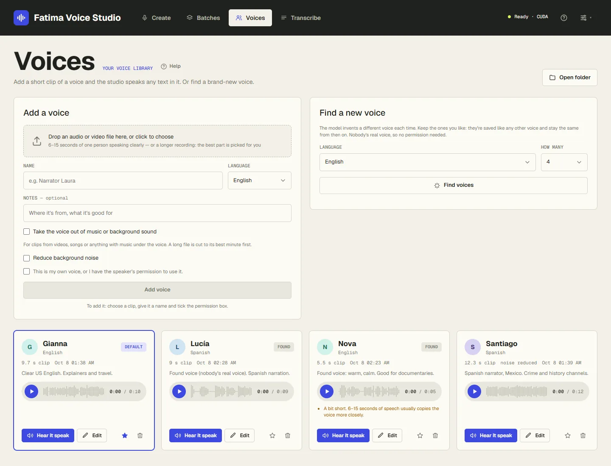
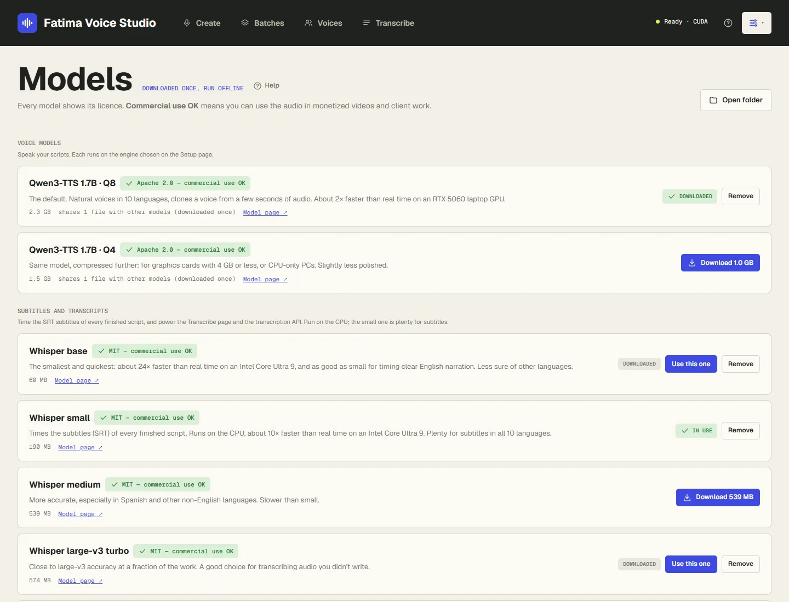
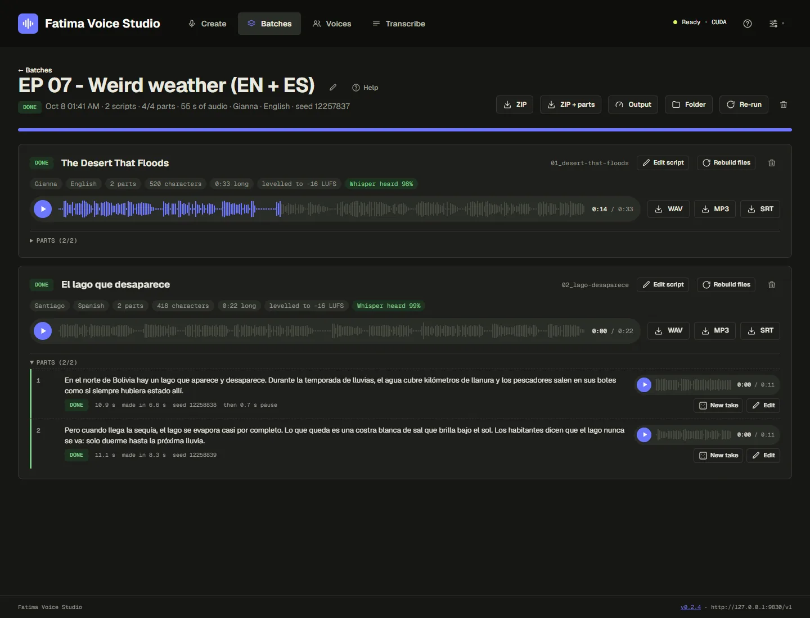
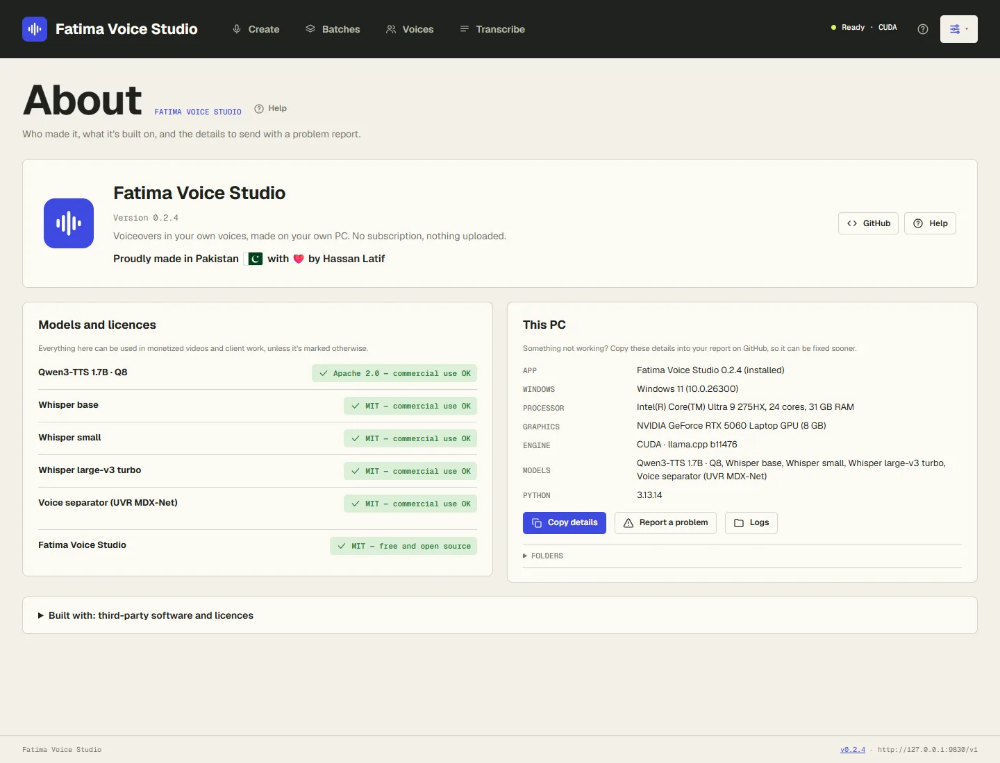

# Fatima Voice Studio

[](https://github.com/hassanxs/fatima-voice-studio/releases/latest) [](https://github.com/hassanxs/fatima-voice-studio/actions/workflows/release.yml) [](https://github.com/hassanxs/fatima-voice-studio/releases) [](LICENSE)  


Voiceovers and voice cloning on your own Windows PC: paste a script (or fifty), pick a voice from your library,
and get each one back as WAV and MP3 at YouTube loudness, with SRT subtitles, in its own named, renamable folder.
It runs [Qwen3-TTS](https://huggingface.co/Qwen/Qwen3-TTS-12Hz-1.7B-Base) locally through the official
[llama.cpp](https://github.com/ggml-org/llama.cpp) engine: no cloud, no account, no per-minute cost, and the
voice model is free for commercial use. It also works as an OpenAI-compatible speech API and as an MCP server
for AI agents (Claude Code, Codex, Antigravity, Hermes…).

On a laptop RTX 5060 (8 GB) it speaks about **2.2× faster than real time**: a 10-minute voiceover takes about
5 minutes, subtitles included. It also runs on AMD and Intel graphics cards (Vulkan) and, more slowly, on the CPU.

The sibling of [Fatima Image Studio](https://github.com/hassanxs/Fatima-Image-Studio).


## Screenshots

| Batches | One batch |
|---|---|
|  |  |
| **Voices** | **Setup** |
|  |  |
| **Models** | **Settings** |
|  |  |
| **Dark mode** | **About** |
|  |  |

**Hear it:** [English sample](docs/samples/english-nova.mp3) (18 s) · [Spanish sample](docs/samples/spanish-lucia.mp3) (17 s).
Both made in the app on a laptop RTX 5060, with *found* voices (voices the model invented, nobody's real voice),
levelled to −16 LUFS.

## Download and install

Get `FatimaVoiceStudio-Setup-<version>.exe` from the
[latest release](https://github.com/hassanxs/fatima-voice-studio/releases/latest) and run it. It installs for
your Windows user only (no admin prompt) and is small, because the engine and models aren't bundled: the app
downloads the ones that suit your PC on its **Setup** page, which opens by itself the first time (about 2.9 GB
in all on an NVIDIA PC: engine 580 MB, voice model 2.3 GB, subtitles model 190 MB).

The installer isn't code-signed yet, so Windows SmartScreen may say "Windows protected your PC". Choose
**More info → Run anyway**. Each release lists the installer's SHA-256, and the installer is built by GitHub
Actions from the tagged source.

**Updates:** the installed app checks GitHub for a new release when it starts and every 6 hours, and shows it
under **Settings → Updates**. *Quick update* replaces only the app's own files; *Full update* runs the new
installer. Both check the download's SHA-256 and keep your voices, models, settings and audio.

**Uninstall** from Windows Settings → Apps. It asks whether to also delete the downloaded models, engine and
settings; your voice library and your audio are always kept.

**System requirements:** Windows 10 or 11 (64-bit). Best on an NVIDIA GeForce RTX card with 4 GB or more; AMD
and Intel cards work through Vulkan, and CPU-only works at about 0.7× real time. 8 GB of RAM and 4 GB of free
disk.

## Start

Start **Fatima Voice Studio** from the Start menu. It runs in the background with a tray icon and opens
http://127.0.0.1:9830/ in your browser. Starting it again while it runs just opens the page. New to it? Follow
[Getting started](studio/help/getting-started.md).

Tray menu: open, copy API URL / key, open batches folder, *Start with Windows*, quit. The dot on the tray icon
shows what it's doing: none = ready, amber = speaking or writing files, red = engine problem. A Windows
notification says when a batch is finished.

### Run from source

Python 3.11+ on Windows:

```bash
python -m pip install -r requirements.txt
python -m studio
```

`python -m studio` runs it in a console window with the log visible. `pythonw -m studio --tray` runs it as the
tray app, and `python -m studio --install` adds a Start menu entry and a launcher in the folder. Run from source,
everything (settings, models, engine, voices, batches) stays inside the project folder.

## Help and guides

Step-by-step guides for every part of the app are in [`studio/help`](studio/help/README.md), and the same pages are
inside the app under **Help** (with a *Help* link on every page, and search).

- [Getting started](studio/help/getting-started.md): install, Setup, your first voice and voiceover
- [Voices](studio/help/voices.md) · [Making voiceovers](studio/help/making-voiceovers.md) ·
  [Writing scripts for the voice](studio/help/writing-scripts.md) · [Batches and fixing parts](studio/help/batches.md)
- [Pronunciation](studio/help/pronunciation.md) · [Transcribe](studio/help/transcribe.md) ·
  [Setup and models](studio/help/setup-and-models.md) · [Settings](studio/help/settings.md)
- [Files and folders](studio/help/files-and-folders.md) · [Updates and uninstalling](studio/help/updates.md) ·
  [Connect: API and AI agents](studio/help/connect.md)
- [Troubleshooting](studio/help/troubleshooting.md) · [Questions and answers](studio/help/faq.md)

## What it does

- **Voices** — add a 6–15 second clip of a voice (or a longer recording, a video, even a song: the voice is taken
  out of the music), or *find* a brand-new voice that belongs to nobody. [More](studio/help/voices.md)
- **Quick takes and batches** — one line right now, or many scripts at once: typed, pasted and split on
  `### Title` lines, or imported from .txt, .md and .csv files, each with its own voice and language if you like.
  [More](studio/help/making-voiceovers.md)
- **Finished files** — every script becomes `01_title.wav`, `.mp3` and `.srt`, levelled to −16 LUFS (YouTube
  voiceover level) with peaks under −1 dB. Subtitles use your script's exact words; Whisper only times them.
- **Natural reading** — paragraphs and `[pause 2s]` tags for pauses, speed from 0.85× to 1.2× without changing the
  pitch, numbers and money read as words in six languages, and a
  [pronunciation list](studio/help/pronunciation.md) for names and abbreviations.
- **Fix without starting over** — long scripts are spoken in parts of about 40 seconds; redo one part with a new
  take, edit its text, or edit the script: only what changed is spoken again. Parts that may have gone wrong are
  found and marked for you. [More](studio/help/batches.md)
- **A queue that keeps going** — reorder, pause, resume; if the PC stops, the batch carries on where it left off.
- **Channel presets**, **Transcribe** (video or audio to TXT, SRT and VTT), an **OpenAI-compatible API** and an
  **MCP server** for AI agents.

## Models and licences

| Model | Licence | Notes |
|---|---|---|
| Qwen3-TTS 1.7B · Q8 (default) / Q4 | Apache 2.0 — commercial use OK | 10 languages: English, Spanish, French, German, Italian, Portuguese, Russian, Japanese, Korean, Chinese |
| Whisper base, small, medium, large-v3 turbo, large-v3 | MIT — commercial use OK | Subtitle timing and transcription, on the CPU |
| UVR MDX-Net Voc_FT (voice separator) | MIT — commercial use OK | Takes a voice out of music |

Every model shows its licence in the app. Non-commercial models would carry a red label and are refused to AI
agents unless allowed on the Connect page. See [Setup and models](studio/help/setup-and-models.md) and
[`THIRD_PARTY_NOTICES.md`](THIRD_PARTY_NOTICES.md).

## API and AI agents

OpenAI-compatible API at `http://127.0.0.1:9830/v1` with `Authorization: Bearer <api key from Settings>`:
`POST /v1/audio/speech`, `POST /v1/audio/transcriptions`, `GET /v1/audio/voices`, `GET /v1/models`, `GET /v1/health`.
Interactive docs at http://127.0.0.1:9830/docs.

```python
from openai import OpenAI
client = OpenAI(base_url="http://127.0.0.1:9830/v1", api_key="<api key>")
client.audio.speech.create(model="qwen3-tts", voice="Narrator", input="Hello!").write_to_file("hello.mp3")
```

MCP server for AI agents at `http://127.0.0.1:9830/mcp` (same key), or over stdio with `studio_mcp.py`; ready-to-copy
setup for Claude Code, Codex, Antigravity and Hermes is on the **Connect** page:

```bash
claude mcp add --scope user --transport http fatima-voice-studio http://127.0.0.1:9830/mcp --header "Authorization: Bearer <api key>"
```

Agents can't download models or delete anything, only write to the Exports folder, and only read from the folders
allowed on the Connect page. The full tool list and guard rails: [Connect](studio/help/connect.md).

## Building the installer

See [`packaging/README.md`](packaging/README.md). In short, `packaging\build.ps1` stages the source with the
official embeddable Python and the pinned packages in `packaging/requirements-lock.txt`, then Inno Setup packs it.
Pushing a `v*` tag makes GitHub Actions build it and attach it to a release.

## Privacy

Fatima Voice Studio runs entirely on your PC. It has no telemetry, no analytics and no account. It only goes
online when you ask it to: downloading an engine build (from GitHub) or a model (from Hugging Face) with the
Download buttons, checking for updates (GitHub, can be turned off), or reading a link you (or your AI agent) give
it. Scripts, voices and audio never leave your PC. The API and MCP server listen on `127.0.0.1` only and require
the API key.

## Licence

MIT, see [`LICENSE`](LICENSE). Third-party software and the models the app can download keep their own licences:
see [`THIRD_PARTY_NOTICES.md`](THIRD_PARTY_NOTICES.md).
