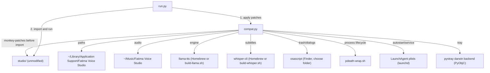

# macOS Port Implementation Plan

> **For agentic workers:** REQUIRED SUB-SKILL: Use superpowers:subagent-driven-development (recommended) or superpowers:executing-plans to implement this plan task-by-task. Steps use checkbox (`- [ ]`) syntax for tracking.

**Goal:** Add a `macos/` compatibility layer (mirroring `linux/`) that lets `studio/` run on Apple Silicon Macs, with a smoke-tested `compat.py`, `run.py`, `setup.sh` and docs, without changing `studio/`.

**Architecture:** One module, `macos/compat.py`, monkey-patches `studio/` at runtime before it is imported (same pattern as `linux/compat.py`): one `_patch_*()` function per concern (paths/engine, tools, hardware, trash/dialogs/misc, autostart/service, process lifecycle, tray, web wording), all wired together by `apply()`. `studio/__main__.py` already runs the tray on the main thread with the server in a background thread, which is exactly what `pystray`'s `darwin` backend needs — no changes to `run.py`'s threading model relative to `linux/run.py`.

**Tech Stack:** Python 3.13 (`uv`), FastAPI/uvicorn (already used by `studio/`), `pystray` + `pyobjc-framework-Cocoa` (tray), Homebrew `llama.cpp`/`whisper.cpp` (or a self-built fallback with `-DGGML_METAL=ON`), `osascript`/`pbcopy`/`open`/`sysctl`/`pmset` (macOS system tools), `launchd` (LaunchAgent plists).

**Spec:** `docs/superpowers/specs/2026-10-10-macos-port-design.md`

## Global Constraints

- Apple Silicon (arm64) macOS only — on Intel Macs `compat.apply()` must raise, not silently misdetect hardware (spec Non-goals).
- `studio/` stays unmodified. Verify with `git diff origin/main -- studio/` after each task that touches `studio/`'s behavior.
- No shared platform-neutral core with `linux/` in this iteration (spec Non-goals).
- No `.app` bundle, code signing or notarization (spec Non-goals).
- The engine needs llama.cpp build b10270 or newer for Qwen3-TTS (same floor as `linux/`; see `linux/test_smoke.py`'s `ENGINE_FLAGS`/`LLAMA_MIN_BUILD`).
- All project documentation (README, ARCHITECTURE, code comments, commit messages) is English. Only files under `/Volumes/blarks/Agenten` are German.
- Nothing a test writes may touch the real `~/Library/Application Support`, `~/Music` or `~/Library/LaunchAgents` — redirect with `FVS_HOME`, `FVS_MUSIC_DIR`, `FVS_LAUNCH_AGENTS_DIR` the same way `linux/test_smoke.py` redirects `FVS_HOME`/`XDG_CONFIG_HOME`/`XDG_MUSIC_DIR`.

## Review Focus

1. Intel Mac (x86_64 darwin) running `macos/run.py` — `apply()` must refuse clearly instead of reporting unified memory that doesn't exist (Task 1).
2. A Mac with no `llama-tts`/`whisper-cli` on PATH and no local fallback build — Setup page must show an actionable Homebrew/build-script hint, not a silent crash or a Windows download link (Task 4).
3. The engine process must not outlive the app when the app is killed with `kill -9` — macOS has no `pdeathsig`; this is custom logic with no OS safety net if it's wrong (Task 8).
4. A left-over Windows `ffmpeg.exe`/download artifact in `engine/ffmpeg/` must never be picked up or executed on macOS (Task 4, mirrors a real bug class already guarded against on Linux).
5. Toggling "Start at login" twice (on, then off) must leave no LaunchAgent registered with `launchd` and no stale plist file (Task 7).

---

## File Structure

```
macos/
  compat.py              # the compatibility layer, built up task by task
  run.py                  # entry point (mirrors linux/run.py)
  setup.sh                # venv + dependencies + tool check + optional LaunchAgent service
  build-llama.sh           # fallback: build llama.cpp from source with -DGGML_METAL=ON
  build-whisper.sh         # fallback: build whisper.cpp from source with -DGGML_METAL=ON
  pdeath-wrap.sh            # makes the engine die with the app (no pdeathsig on macOS)
  fatima-voice-studio       # launcher script (mirrors linux/fatima-voice-studio)
  requirements-macos.txt    # same as requirements.txt, minus pywin32, plus pyobjc-framework-Cocoa
  test_smoke.py             # smoke tests, same structure as linux/test_smoke.py
  README.md
  ARCHITECTURE.md
```

---

### Task 1: Scaffolding — paths, `find_tool`, `llama_build`, and the `apply()` guard

**Files:**
- Create: `macos/compat.py`
- Create: `macos/test_smoke.py`
- Test: `macos/test_smoke.py` (same file; smoke tests double as the test suite, same as `linux/test_smoke.py`)

**Interfaces:**
- Produces: `compat.MACOS_DIR: Path`, `compat.REPO: Path`, `compat.SYSTEM_ENGINE: str`, `compat.fvs_home() -> Path`, `compat.music_dir() -> Path`, `compat.find_tool(env: str, name: str) -> str | None`, `compat._run(args: list[str], timeout: float = 10) -> str`, `compat.llama_build() -> str | None`, `compat.apply() -> None`

- [ ] **Step 1: Write the failing static checks (studio/ hasn't changed underneath us)**

Create `macos/test_smoke.py` with this content (identical `TARGETS`/`CLASS_MEMBERS`/`DEFAULT_KEYS`/`ENGINE_FLAGS` to `linux/test_smoke.py` — `studio/` is the same code regardless of platform, so the same static guard applies):

```python
#!/usr/bin/env python3
"""Smoke test for the macOS compatibility layer (macos/compat.py).

compat.py patches parts of studio/ at runtime. If upstream renames or moves one of them, the patch stops working
without any error message. This test is there to notice that.

  static    every name compat.py replaces or relies on still exists in studio/ (read with ast, nothing is imported)
  runtime   apply() works, and the patched names are the ones the rest of studio/ really uses

It needs the packages from requirements-macos.txt, Apple Silicon macOS, but no GPU and no llama-tts. Everything it
writes goes to a temporary folder, not to your home directory.

  .venv/bin/python macos/test_smoke.py
  .venv/bin/python -m pytest macos/test_smoke.py
"""
import ast
import os
import platform
import subprocess
import sys
import tempfile
import time
import unittest
import unittest.mock
from pathlib import Path

HERE = Path(__file__).resolve().parent
STUDIO = HERE.parent / "studio"

TARGETS = {
    "config": {"HOME", "DATA", "CONFIG_FILE", "VOICES", "MUSIC", "DEFAULTS", "ENGINES", "ENGINE_EXE", "WHISPER_EXE",
               "engine_dir", "installed_engines", "whisper_dir", "tool_dir"},
    "hardware": {"_vendor", "_registry_gpus", "_ram_gb", "_cpu", "on_battery", "recommended_engine"},
    "autostart": {"enabled", "set_enabled", "python_console", "install_launchers"},
    "updater": {"Updater"},
    "trash": {"to_recycle_bin"},
    "winui": {"pick_folder"},
    "engine": {"subprocess"},
    "tray": {"copy", "Tray"},
    "app": {"create_app", "Updater", "pick_folder"},
    "media": {"ffmpeg_exe", "ffmpeg_source"},
    "downloads": {"Downloads"},
}
CLASS_MEMBERS = {
    ("updater", "Updater"): {"watch", "check", "start"},
    ("tray", "Tray"): {"__init__"},
    ("downloads", "Downloads"): {"tools", "start_tool", "delete_tool", "start_engine", "_whisper_missing"},
}
DEFAULT_KEYS = {"batches_dir", "exports_dir", "models_dir", "engine", "check_updates"}
ENGINE_FLAGS = {"-m", "-mm", "-ngl", "-c", "4096", "-n", "-f", "--tts-lang", "-s", "--output", "--tts-speaker-file"}


def parse(module: str) -> ast.Module:
    return ast.parse((STUDIO / f"{module}.py").read_text(encoding="utf-8"), filename=f"studio/{module}.py")


def top_level_names(tree: ast.Module) -> set[str]:
    names = set()
    for node in tree.body:
        if isinstance(node, (ast.FunctionDef, ast.AsyncFunctionDef, ast.ClassDef)):
            names.add(node.name)
        elif isinstance(node, ast.Assign):
            names.update(t.id for t in node.targets if isinstance(t, ast.Name))
        elif isinstance(node, ast.AnnAssign) and isinstance(node.target, ast.Name):
            names.add(node.target.id)
        elif isinstance(node, ast.Import):
            names.update((a.asname or a.name).split(".")[0] for a in node.names)
        elif isinstance(node, ast.ImportFrom):
            names.update(a.asname or a.name for a in node.names)
    return names


class StaticChecks(unittest.TestCase):
    """Does what compat.py patches still exist upstream? Runs anywhere, imports nothing."""

    def test_patch_targets_exist(self):
        for module, wanted in TARGETS.items():
            with self.subTest(module=module):
                self.assertTrue((STUDIO / f"{module}.py").exists(), f"studio/{module}.py is gone")
                missing = wanted - top_level_names(parse(module))
                self.assertFalse(missing, f"studio/{module}.py no longer has {sorted(missing)}; compat.py patches them")

    def test_patched_class_members_exist(self):
        for (module, cls), wanted in CLASS_MEMBERS.items():
            with self.subTest(cls=f"{module}.{cls}"):
                node = next(n for n in parse(module).body if isinstance(n, ast.ClassDef) and n.name == cls)
                members = {n.name for n in node.body if isinstance(n, (ast.FunctionDef, ast.AsyncFunctionDef))}
                self.assertFalse(wanted - members, f"{module}.{cls} no longer has {sorted(wanted - members)}")

    def test_config_defaults_keys_exist(self):
        for node in parse("config").body:
            if isinstance(node, ast.Assign) and any(getattr(t, "id", "") == "DEFAULTS" for t in node.targets):
                keys = {k.value for k in node.value.keys if isinstance(k, ast.Constant)}
                self.assertFalse(DEFAULT_KEYS - keys, f"config.DEFAULTS lost {sorted(DEFAULT_KEYS - keys)}")
                return
        self.fail("config.DEFAULTS not found")

    def test_engine_command_line(self):
        used = {n.value for n in ast.walk(parse("engine")) if isinstance(n, ast.Constant) and isinstance(n.value, str)}
        self.assertFalse(ENGINE_FLAGS - used,
                         f"engine.py no longer passes {sorted(ENGINE_FLAGS - used)} to llama-tts. "
                         "Check LLAMA_MIN_BUILD in setup.sh and the llama.cpp version in the README.")


@unittest.skipUnless(sys.platform == "darwin" and platform.machine() == "arm64", "the compatibility layer is for Apple Silicon Macs")
class RuntimeChecks(unittest.TestCase):
    """apply() the patches, then check what the app really ends up using."""

    @classmethod
    def setUpClass(cls):
        cls.tmp = tempfile.TemporaryDirectory()
        cls.addClassCleanup(cls.tmp.cleanup)
        root = Path(cls.tmp.name)
        os.environ.update(FVS_HOME=str(root / "home"), FVS_MUSIC_DIR=str(root / "music"),
                          FVS_LAUNCH_AGENTS_DIR=str(root / "launchagents"))
        sys.path.insert(0, str(HERE))
        import compat
        compat.apply()
        cls.compat = compat

    def test_apply_twice_is_harmless(self):
        self.compat.apply()

    def test_fvs_home_and_music_dir_use_the_overrides(self):
        root = Path(self.tmp.name)
        self.assertEqual(self.compat.fvs_home(), root / "home")
        self.assertEqual(self.compat.music_dir(), root / "music" / "Fatima Voice Studio")

    def test_llama_build_is_read_from_every_known_version_format(self):
        script = Path(self.tmp.name) / "fake-llama-tts"
        old = os.environ.get("FVS_LLAMA_TTS")
        try:
            os.environ["FVS_LLAMA_TTS"] = str(script)
            for line, want in [("version: 0.3.0-dev (build 10689, commit c13e6fe)", "b10689"),
                               ("version: 10689 (c13e6fe)", "b10689"), ("version: b9000 (abc)", "b9000"),
                               ("no version here", None)]:
                script.write_text(f"#!/bin/sh\necho '{line}' >&2\n")
                script.chmod(0o755)
                self.assertEqual(self.compat.llama_build(), want, line)
            os.environ["FVS_LLAMA_TTS"] = str(script) + "-missing"
            self.assertIsNone(self.compat.llama_build())
        finally:
            if old is None:
                os.environ.pop("FVS_LLAMA_TTS", None)
            else:
                os.environ["FVS_LLAMA_TTS"] = old

    def test_wrong_architecture_is_rejected(self):
        with unittest.mock.patch("platform.machine", return_value="x86_64"):
            self.compat._applied = False
            try:
                with self.assertRaises(RuntimeError):
                    self.compat.apply()
            finally:
                self.compat._applied = False
                self.compat.apply()  # restore the patched state for the remaining tests in this class


if __name__ == "__main__":
    unittest.main(verbosity=2)
```

- [ ] **Step 2: Run it to confirm it fails (compat.py doesn't exist yet)**

Run: `cd macos && python3 test_smoke.py`
Expected: `ModuleNotFoundError: No module named 'compat'` (or an import error) from `RuntimeChecks.setUpClass`, and `StaticChecks` passing (it doesn't import `compat`).

- [ ] **Step 3: Write `macos/compat.py` with the scaffolding**

```python
"""macOS compatibility layer for Fatima Voice Studio.

The upstream app is Windows-only (registry, ctypes.windll, PowerShell, Recycle Bin, job objects, .exe engines).
Instead of editing studio/, this module is applied *before* studio is imported and replaces exactly those parts.
Call `apply()` first, then import/run `studio` as usual (see run.py). Mirrors linux/compat.py; see
docs/superpowers/specs/2026-10-10-macos-port-design.md for why this stays a separate module instead of a shared core.

What it does:
  * paths      user data lives in $FVS_HOME (default ~/Library/Application Support/Fatima Voice Studio),
               audio in ~/Music/Fatima Voice Studio
  * engine     one engine called "system": the llama-tts / whisper-cli found on PATH (or FVS_LLAMA_TTS / FVS_WHISPER_CLI)
  * hardware   CPU / RAM / battery from sysctl and pmset; GPU is unified memory (vram_gb == ram_gb), not the registry
  * trash      osascript (Finder) instead of the Recycle Bin
  * dialogs    osascript "choose folder" instead of the Windows one
  * autostart  a LaunchAgent plist instead of Startup-folder .lnk files
  * updater    switched off (Windows installer updates); update with `git pull`
  * tools      ffmpeg and whisper-cli come from Homebrew / build-*.sh; the Windows downloads are never offered
  * engine     llama-tts dies with the app (pdeath-wrap.sh polls the app's pid; macOS has no pdeathsig)
  * wording    visible "Windows" texts in the web page are rewritten (Start at login, Trash …)
  * misc       os.startfile -> open, clipboard -> pbcopy
"""
import os
import platform
import re
import subprocess
import sys
from pathlib import Path

MACOS_DIR = Path(__file__).resolve().parent
REPO = MACOS_DIR.parent
SYSTEM_ENGINE = "system"
PDEATH_WRAP = MACOS_DIR / "pdeath-wrap.sh"

_applied = False


def fvs_home() -> Path:
    return Path(os.environ.get("FVS_HOME") or Path.home() / "Library" / "Application Support" / "Fatima Voice Studio")


def music_dir() -> Path:
    return Path(os.environ.get("FVS_MUSIC_DIR") or Path.home() / "Music") / "Fatima Voice Studio"


def find_tool(env: str, name: str) -> str | None:
    """A tool path from an environment variable, else from PATH, else the local fallback build."""
    import shutil
    given = os.environ.get(env)
    if given:
        return given if Path(given).exists() else None
    on_path = shutil.which(name)
    if on_path:
        return on_path
    local = MACOS_DIR / "bin" / name  # built by build-llama.sh / build-whisper.sh
    return str(local) if local.exists() else None


def _run(args: list[str], timeout: float = 10) -> str:
    try:
        return subprocess.run(args, capture_output=True, text=True, timeout=timeout).stdout
    except (OSError, subprocess.TimeoutExpired):
        return ""


def llama_build() -> str | None:
    """The build of the installed llama-tts as "b10689", or None. `--version` prints "version: 0.3.0-dev (build 10689,
    commit ...)" (newer builds) or "version: 10689 (commit)" (older ones), on stderr or stdout."""
    tool = find_tool("FVS_LLAMA_TTS", "llama-tts")
    if not tool:
        return None
    try:
        r = subprocess.run([tool, "--version"], capture_output=True, text=True, timeout=10)
    except (OSError, subprocess.TimeoutExpired):
        return None
    m = re.search(r"^version: .*\(build (\d+)", r.stdout + r.stderr, re.M) \
        or re.search(r"^version: b?(\d+) \(", r.stdout + r.stderr, re.M)
    return f"b{m.group(1)}" if m else None


# ---- entry ----------------------------------------------------------------------------------------------

def apply() -> None:
    global _applied
    if _applied:
        return
    if sys.platform != "darwin" or platform.machine() != "arm64":
        raise RuntimeError("macos/compat.py is for Apple Silicon Macs only.")
    sys.path.insert(0, str(REPO))
    _applied = True
```

- [ ] **Step 4: Run the tests to verify they pass**

Run: `cd macos && python3 test_smoke.py -v`
Expected: all `StaticChecks` and `RuntimeChecks` tests `PASS` (or `ok`).

- [ ] **Step 5: Commit**

```bash
git add macos/compat.py macos/test_smoke.py
git commit -m "macos: scaffolding - paths, find_tool, llama_build, apply() guard"
```

---

### Task 2: Engine and Whisper acquisition (the open question from the spec)

**Files:**
- Create: `macos/build-llama.sh`
- Create: `macos/build-whisper.sh`
- Modify: `macos/test_smoke.py` (add a syntax-only static check)

**Interfaces:**
- Produces: `macos/build-llama.sh`, `macos/build-whisper.sh` (fallback builds dropped into `macos/bin/`, found by `find_tool()` from Task 1)
- Consumes: `compat.llama_build()` (Task 1), used below to verify what got installed

This task is investigation, not TDD in the usual sense — the question can only be answered by actually installing things on this Mac. Do it in this order:

- [ ] **Step 1: Try Homebrew's llama.cpp first**

```bash
brew install llama.cpp
ls /opt/homebrew/bin | grep -i llama
/opt/homebrew/bin/llama-tts --version
```

If `llama-tts` is missing from that `ls`, or `--version` reports a build older than `b10270`, Homebrew's bottle doesn't cover this — move to Step 3 (the fallback build). If it reports `b10270` or newer, Homebrew is sufficient; still write the fallback script in Step 3 for machines where it isn't, but it won't be needed on this Mac.

- [ ] **Step 2: Try Homebrew's whisper.cpp**

```bash
brew install whisper.cpp
ls /opt/homebrew/bin | grep -i whisper
```

Record whether `whisper-cli` is present. Same decision as Step 1: present and runnable → Homebrew is enough; otherwise the fallback build in this task is needed.

- [ ] **Step 3: Write the fallback build scripts regardless**

Even if Homebrew worked on this Mac, write both scripts now so machines where it doesn't have a documented path (same reasoning as `linux/build-whisper.sh` existing even though most Linux systems can use a distro package). First confirm the actual CMake target names in each upstream repo, since guessing wrong fails the build late:

```bash
work=$(mktemp -d)
git clone --depth 1 https://github.com/ggml-org/llama.cpp "$work/llama" 2>&1 | tail -3
grep -rl "add_executable(llama-tts" "$work/llama/tools" 2>/dev/null
git clone --depth 1 https://github.com/ggml-org/whisper.cpp "$work/whisper" 2>&1 | tail -3
grep -rl "add_executable(whisper-cli\|whisper-cli" "$work/whisper/examples" "$work/whisper/tools" 2>/dev/null
rm -rf "$work"
```

Adjust the `--target` names below if this turns up something different from `llama-tts` / `whisper-cli`.

Create `macos/build-llama.sh`:

```bash
#!/usr/bin/env bash
# Builds llama-tts (llama.cpp, Metal) into macos/bin/. Use this when Homebrew's llama.cpp either has no
# llama-tts binary or is older than the Qwen3-TTS support the app needs (build b10270, 2026-08-04).
set -euo pipefail
here="$(cd "$(dirname "$0")" && pwd)"
tag="${LLAMA_TAG:-master}"   # Homebrew's own tag may be too old; master always has the latest build number
work="$(mktemp -d)"; trap 'rm -rf "$work"' EXIT
git clone --depth 1 --branch "$tag" https://github.com/ggml-org/llama.cpp "$work/src"
cmake -S "$work/src" -B "$work/build" -DCMAKE_BUILD_TYPE=Release -DBUILD_SHARED_LIBS=OFF \
      -DGGML_METAL=ON -DLLAMA_BUILD_TESTS=OFF -DLLAMA_BUILD_SERVER=OFF >/dev/null
cmake --build "$work/build" --target llama-tts -j"$(sysctl -n hw.ncpu)"
mkdir -p "$here/bin"
install -m755 "$work/build/bin/llama-tts" "$here/bin/llama-tts"
echo "Built $here/bin/llama-tts ($tag)"
```

Create `macos/build-whisper.sh`:

```bash
#!/usr/bin/env bash
# Builds whisper-cli (whisper.cpp, Metal) into macos/bin/. Use this if `brew install whisper-cpp` isn't wanted
# (it pulls in its own llama.cpp, which can conflict with the one build-llama.sh built).
set -euo pipefail
here="$(cd "$(dirname "$0")" && pwd)"
tag="${WHISPER_TAG:-v1.9.5}"
work="$(mktemp -d)"; trap 'rm -rf "$work"' EXIT
git clone --depth 1 --branch "$tag" https://github.com/ggml-org/whisper.cpp "$work/src"
cmake -S "$work/src" -B "$work/build" -DCMAKE_BUILD_TYPE=Release -DBUILD_SHARED_LIBS=OFF \
      -DGGML_METAL=ON -DWHISPER_BUILD_TESTS=OFF -DWHISPER_BUILD_SERVER=OFF -DWHISPER_BUILD_EXAMPLES=ON >/dev/null
cmake --build "$work/build" --target whisper-cli -j"$(sysctl -n hw.ncpu)"
mkdir -p "$here/bin"
install -m755 "$work/build/bin/whisper-cli" "$here/bin/whisper-cli"
echo "Built $here/bin/whisper-cli ($tag)"
```

```bash
chmod +x macos/build-llama.sh macos/build-whisper.sh
```

- [ ] **Step 4: Add a static syntax check so a future shell edit can't silently break these**

Add to `StaticChecks` in `macos/test_smoke.py`:

```python
    def test_shell_scripts_are_syntactically_valid(self):
        for name in ("build-llama.sh", "build-whisper.sh"):
            with self.subTest(script=name):
                r = subprocess.run(["bash", "-n", str(HERE / name)], capture_output=True, text=True)
                self.assertEqual(r.returncode, 0, r.stderr)
```

- [ ] **Step 5: Run the smoke test**

Run: `cd macos && python3 test_smoke.py -v`
Expected: `test_shell_scripts_are_syntactically_valid` PASS; everything from Task 1 still PASS.

- [ ] **Step 6: Run whichever path this Mac actually needs, and record the result**

If Homebrew was sufficient (Step 1/2), nothing further to run. If not:

```bash
./macos/build-llama.sh    # only if Homebrew's llama-tts was missing or too old
./macos/build-whisper.sh  # only if Homebrew's whisper-cli was missing
.venv/bin/python -c "import sys; sys.path.insert(0, 'macos'); import compat; print(compat.llama_build())"
```

Expected: prints a build number `>= b10270`. Note the actual path taken (Homebrew vs. self-built) in `macos/SESSION.md` for Task 13's README "Tested" table.

- [ ] **Step 7: Commit**

```bash
git add macos/build-llama.sh macos/build-whisper.sh macos/test_smoke.py
git commit -m "macos: fallback build scripts for llama.cpp and whisper.cpp with Metal"
```

---

### Task 3: `_patch_config` — paths, engine registration

**Files:**
- Modify: `macos/compat.py`
- Modify: `macos/test_smoke.py`

**Interfaces:**
- Consumes: `fvs_home()`, `music_dir()`, `llama_build()`, `SYSTEM_ENGINE` (Task 1)
- Produces: `compat._patch_config() -> None`, called from `apply()`

- [ ] **Step 1: Write the failing test**

Add to `RuntimeChecks`:

```python
    def test_paths_and_engine(self):
        home = Path(os.environ["FVS_HOME"])
        from studio import config as c
        self.assertEqual(c.ENGINE_EXE, "llama-tts")
        self.assertEqual(c.WHISPER_EXE, "whisper-cli")
        self.assertEqual(list(c.ENGINES), ["system"])
        self.assertEqual(c.DEFAULTS["engine"], "system")
        self.assertFalse(c.DEFAULTS["check_updates"])
        self.assertEqual(c.engine_dir({"engine": "system"}), home / "engine" / "system")
        self.assertEqual(c.DATA, home / "data")
        self.assertIsInstance(c.installed_engines({"engine": "system"}), list)

    def test_about_page_does_not_show_the_windows_engine_pin(self):
        from studio import config as c
        self.assertEqual(c.ENGINE_RELEASE, self.compat.llama_build() or "not found")
```

- [ ] **Step 2: Run to confirm it fails**

Run: `cd macos && python3 test_smoke.py -v`
Expected: `FAIL` — `studio.config` still has the Windows engine list (`ENGINES` not `["system"]`).

- [ ] **Step 3: Implement `_patch_config` and wire it into `apply()`**

Add to `macos/compat.py`:

```python
def _link(target: str | None, link: Path) -> None:
    """Keep link -> target in step with what is installed (the app expects <engine dir>/<exe>)."""
    try:
        if target is None:
            if link.is_symlink():
                link.unlink()
            return
        if link.is_symlink() and os.readlink(link) == target:
            return
        link.parent.mkdir(parents=True, exist_ok=True)
        link.unlink(missing_ok=True)
        link.symlink_to(target)
    except OSError:
        pass


def _link_tools() -> None:
    home = fvs_home()
    _link(find_tool("FVS_LLAMA_TTS", "llama-tts"), home / "engine" / SYSTEM_ENGINE / "llama-tts")
    _link(find_tool("FVS_WHISPER_CLI", "whisper-cli"), home / "engine" / "whisper" / "whisper-cli")


def _patch_config() -> None:
    from studio import config

    home = fvs_home()
    config.HOME = home
    config.DATA = home / "data"
    config.CONFIG_FILE = config.DATA / "config.json"
    config.VOICES = home / "voices"
    music = music_dir()
    config.MUSIC = music
    d = config.DEFAULTS
    d["batches_dir"] = str(music / "Batches")
    d["exports_dir"] = str(music / "Exports")
    d["models_dir"] = str(home / "models")
    d["engine"] = SYSTEM_ENGINE
    d["check_updates"] = False

    config.ENGINE_RELEASE = llama_build() or "not found"
    config.ENGINE_EXE = "llama-tts"
    config.WHISPER_EXE = "whisper-cli"
    config.ENGINES.clear()
    config.ENGINES[SYSTEM_ENGINE] = {
        "label": "System · llama.cpp",
        "about": "The llama-tts installed on this PC (Metal on Apple Silicon, or CPU). Nothing to download here: "
                 "install llama.cpp (build b10270 or newer) with Homebrew (brew install llama.cpp) or build it "
                 "yourself with Metal (see build-llama.sh), then press Check again.",
        "zips": [], "gpu": True}

    def engine_dir(cfg: dict, key: str | None = None) -> Path:
        return home / "engine" / (key or cfg["engine"])

    def installed_engines(cfg: dict) -> list[str]:
        _link_tools()
        return [k for k in config.ENGINES if (engine_dir(cfg, k) / config.ENGINE_EXE).exists()]

    config.engine_dir = engine_dir
    config.installed_engines = installed_engines
    config.whisper_dir = lambda: home / "engine" / "whisper"
    config.tool_dir = lambda key: home / "engine" / key
```

In `apply()`, replace the body after `sys.path.insert(0, str(REPO))` with:

```python
    sys.path.insert(0, str(REPO))
    _patch_config()
    _link_tools()
    _applied = True
```

- [ ] **Step 4: Run the tests to verify they pass**

Run: `cd macos && python3 test_smoke.py -v`
Expected: all PASS.

- [ ] **Step 5: Commit**

```bash
git add macos/compat.py macos/test_smoke.py
git commit -m "macos: _patch_config - Application Support/Music paths, system engine"
```

---

### Task 4: `_patch_tools` — ffmpeg, whisper, no Windows downloads

**Files:**
- Modify: `macos/compat.py`
- Modify: `macos/test_smoke.py`

**Interfaces:**
- Consumes: `find_tool()` (Task 1)
- Produces: `compat._patch_tools() -> None`, `compat.FFMPEG_HINT`, `compat.ENGINE_HINT`, `compat.WHISPER_NOTE`, `compat.WHISPER_WARNING`, called from `apply()`

- [ ] **Step 1: Write the failing tests**

Add to `RuntimeChecks`:

```python
    def _client(self):
        from fastapi.testclient import TestClient
        from studio import config, app
        return TestClient(app.create_app(config.load()), headers={"X-Studio": "1"})

    def test_ffmpeg_is_the_system_one_never_a_windows_exe(self):
        from studio import media, config
        fake_exe = config.tool_dir("ffmpeg") / "ffmpeg.exe"
        fake_exe.parent.mkdir(parents=True, exist_ok=True)
        fake_exe.write_text("MZ not a macOS program")
        self.addCleanup(fake_exe.unlink, missing_ok=True)
        with tempfile.TemporaryDirectory() as bindir:
            real = Path(bindir) / "ffmpeg"
            real.write_text("#!/bin/sh\n")
            real.chmod(0o755)
            old_path = os.environ["PATH"]
            os.environ["PATH"] = bindir
            try:
                self.assertEqual(media.ffmpeg_exe(), str(real), "ffmpeg.exe must not win over the system ffmpeg")
                self.assertEqual(media.ffmpeg_source(), "system")
            finally:
                os.environ["PATH"] = old_path
            os.environ["PATH"] = bindir + "/nothing-here"
            try:
                self.assertIsNone(media.ffmpeg_exe(), "ffmpeg.exe must not be used when there is no system ffmpeg")
                self.assertIsNone(media.ffmpeg_source())
            finally:
                os.environ["PATH"] = old_path

    def test_no_windows_ffmpeg_download_is_offered_or_started(self):
        from studio import config
        c = self._client()
        tools = c.get("/api/tools").json()
        self.assertEqual([t["key"] for t in tools], ["ffmpeg"])
        self.assertTrue(tools[0]["system_only"])
        self.assertEqual(tools[0]["size"], 0)
        r = c.post("/api/tools/ffmpeg/download")
        self.assertEqual(r.status_code, 409)
        self.assertIn("ffmpeg", r.json()["detail"])
        self.assertFalse((config.tool_dir("ffmpeg") / "ffmpeg.exe").exists())

    def test_system_engine_has_no_download(self):
        c = self._client()
        eng = next(e for e in c.get("/api/setup").json()["engines"] if e["key"] == "system")
        self.assertEqual(eng["size"], 0)
        r = c.post("/api/setup/engines/system/download")
        self.assertEqual(r.status_code, 409)
        self.assertIn("nothing to download", r.json()["detail"])

    def test_whisper_model_download_skips_the_windows_zip(self):
        from studio import downloads, config
        d = downloads.Downloads(config.load())
        self.assertFalse(d._whisper_missing(), "no Windows whisper-bin-x64.zip must ever be requested on macOS")
        for m in d.status():
            if m["kind"] == "subtitles":
                self.assertIn("build-whisper.sh", m["about"])

    def test_missing_whisper_cli_gets_a_clear_warning(self):
        from studio import config, hardware
        cfg = config.load()
        folder = Path(cfg["models_dir"])
        folder.mkdir(parents=True, exist_ok=True)
        model = folder / config.MODELS["whisper-base"]["files"][0]
        model.write_bytes(b"x")
        self.addCleanup(model.unlink, missing_ok=True)
        old = os.environ.get("FVS_WHISPER_CLI")
        os.environ["FVS_WHISPER_CLI"] = "/nonexistent/whisper-cli"
        try:
            hw = hardware.detect(True)
            msgs = [w["message"] for w in hardware.warnings(hw, cfg, "system")]
        finally:
            if old is None:
                del os.environ["FVS_WHISPER_CLI"]
            else:
                os.environ["FVS_WHISPER_CLI"] = old
        self.assertTrue(any("./build-whisper.sh" in m or "brew install whisper-cpp" in m for m in msgs), msgs)
```

- [ ] **Step 2: Run to confirm failure**

Run: `cd macos && python3 test_smoke.py -v`
Expected: `FAIL` — `/api/tools` still lists the Windows tools, ffmpeg.exe still wins.

- [ ] **Step 3: Implement `_patch_tools` and add it to `apply()`**

Add to `macos/compat.py`:

```python
FFMPEG_HINT = "ffmpeg isn't installed on this PC. Install it with Homebrew (brew install ffmpeg), then reload this page."
ENGINE_HINT = ("There is nothing to download for this engine. Install llama.cpp with Homebrew (brew install llama.cpp) "
               "or build it yourself with Metal (see build-llama.sh), then press Check again.")
WHISPER_NOTE = (" On macOS this also needs whisper-cli: brew install whisper-cpp, or run ./build-whisper.sh "
                "(see macos/README.md).")
WHISPER_WARNING = ("Subtitles and transcripts need whisper-cli, which was not found. Install it with Homebrew "
                   "(brew install whisper-cpp) or run ./build-whisper.sh in the macos folder (see macos/README.md), "
                   "then press Check again. The model download itself is fine.")


def _patch_tools() -> None:
    """studio/ downloads Windows programs (ffmpeg.exe, whisper-cli.exe) and prefers its own ffmpeg.exe over the
    system one. None of that is wanted here: use the system ffmpeg, never an ffmpeg.exe, and tell the user what to do."""
    import shutil
    from fastapi import HTTPException
    from studio import config, downloads, hardware, media

    media.ffmpeg_exe = lambda: shutil.which("ffmpeg")
    media.ffmpeg_source = lambda: "system" if shutil.which("ffmpeg") else None
    config.TOOLS.clear()
    config.TOOLS["ffmpeg"] = {
        "label": "ffmpeg (video files)", "exe": "ffmpeg",
        "about": "Lets the app read video files (MP4, MKV, MOV, WEBM…) and M4A/AAC for transcripts and voice clips. "
                 "On macOS this is the ffmpeg installed on this PC, nothing is downloaded: install it with Homebrew "
                 "(brew install ffmpeg), then reload this page.",
        "license": "Installed separately via Homebrew"}
    D = downloads.Downloads

    def tools(self) -> list[dict]:
        t, found = config.TOOLS["ffmpeg"], bool(shutil.which("ffmpeg"))
        return [{"key": "ffmpeg", "label": t["label"], "about": t["about"], "license": t["license"], "size": 0,
                 "installed": False, "on_pc": found, "ready": found, "partial": 0, "job": None, "system_only": True}]

    def start_tool(self, key: str) -> None:
        raise HTTPException(409, FFMPEG_HINT)

    def delete_tool(self, key: str) -> None:
        raise HTTPException(409, "ffmpeg is the system's own copy; the app doesn't manage it.")

    D.tools, D.start_tool, D.delete_tool = tools, start_tool, delete_tool

    real_start_engine = D.start_engine

    def start_engine(self, key: str) -> None:
        if not config.ENGINES.get(key, {}).get("zips"):
            raise HTTPException(409, ENGINE_HINT)
        real_start_engine(self, key)

    D.start_engine = start_engine

    D._whisper_missing = lambda self: False
    for m in config.MODELS.values():
        if m["kind"] == "subtitles":
            m["about"] += WHISPER_NOTE

    real_warnings = hardware.warnings

    def warnings(hw: dict, cfg: dict, engine: str) -> list[dict]:
        out = real_warnings(hw, cfg, engine)
        if config.subtitles_model(cfg) and not find_tool("FVS_WHISPER_CLI", "whisper-cli"):
            out.append({"level": "warn", "code": "no_whisper_cli", "message": WHISPER_WARNING})
        return out

    hardware.warnings = warnings
```

In `apply()`, add `_patch_tools()` after `_patch_config()`:

```python
    _patch_config()
    _patch_tools()
    _link_tools()
```

- [ ] **Step 4: Run the tests to verify they pass**

Run: `cd macos && python3 test_smoke.py -v`
Expected: all PASS.

- [ ] **Step 5: Commit**

```bash
git add macos/compat.py macos/test_smoke.py
git commit -m "macos: _patch_tools - system ffmpeg, no Windows downloads"
```

---

### Task 5: `_patch_hardware` — sysctl, pmset, unified memory

**Files:**
- Modify: `macos/compat.py`
- Modify: `macos/test_smoke.py`

**Interfaces:**
- Consumes: `_run()` (Task 1)
- Produces: `compat._apple_gpus() -> list[dict]`, `compat._ram_gb() -> float`, `compat._cpu() -> str`, `compat._on_battery() -> bool | None`, `compat._patch_hardware() -> None`, called from `apply()`

- [ ] **Step 1: Write the failing test**

Add to `RuntimeChecks`:

```python
    def test_hardware(self):
        from studio import hardware as h
        self.assertIs(h._registry_gpus, self.compat._apple_gpus)
        self.assertEqual(h.recommended_engine({}), "system")
        gpus = h._registry_gpus()
        self.assertEqual(len(gpus), 1)
        self.assertFalse(gpus[0]["integrated"], "a non-integrated GPU is what main_gpu() picks for model_fit()")
        self.assertGreater(gpus[0]["vram_gb"], 0)
        self.assertEqual(gpus[0]["vram_gb"], h._ram_gb(), "unified memory: GPU memory is RAM")
        self.assertGreater(h._ram_gb(), 0)
        self.assertIsInstance(h._cpu(), str)
        self.assertIn(h.on_battery(), (None, True, False))

    def test_model_fit_uses_the_full_unified_memory(self):
        from studio import hardware as h
        hw = h.detect(True)
        # this Mac has 32 GB unified memory; qwen3-tts-q8 must fit without falling back to Q4/CPU
        self.assertEqual(h.model_fit("qwen3-tts-q8", hw, "system"), "fits")
```

- [ ] **Step 2: Run to confirm failure**

Run: `cd macos && python3 test_smoke.py -v`
Expected: `FAIL` — `hardware._registry_gpus` is still the Windows registry reader (`winreg` import even fails outright on macOS without the stub).

- [ ] **Step 3: Implement `_patch_hardware` and add it to `apply()`**

Add to `macos/compat.py`:

```python
import types  # add to the existing import block near the top


def _ram_gb() -> float:
    out = _run(["sysctl", "-n", "hw.memsize"])
    try:
        return round(int(out.strip()) / 1024**3, 1)
    except ValueError:
        return 0.0


def _cpu() -> str:
    return _run(["sysctl", "-n", "machdep.cpu.brand_string"]).strip() or "Unknown CPU"


def _on_battery() -> bool | None:
    """None on a Mac with no battery (e.g. a Mac mini)."""
    out = _run(["pmset", "-g", "batt"])
    lines = out.splitlines()
    if not lines or "InternalBattery" not in out:
        return None
    return "Battery Power" in lines[0]


def _apple_gpus() -> list[dict]:
    """Apple Silicon has no separate VRAM: the GPU shares the Mac's RAM (unified memory)."""
    return [{"name": f"{_cpu()} (unified memory)", "vendor": "apple", "vram_gb": _ram_gb(), "driver": "Metal",
             "integrated": False}]


def _patch_hardware() -> None:
    # studio/hardware.py does `import winreg`. The stub exists only for that import: left in sys.modules it makes
    # the standard library (mimetypes) believe it is on Windows and crash on every static file.
    import mimetypes  # noqa: F401  (loaded before the stub, so it never sees it)
    sys.modules["winreg"] = types.ModuleType("winreg")
    try:
        from studio import hardware
    finally:
        del sys.modules["winreg"]
    hardware._registry_gpus = _apple_gpus
    hardware._ram_gb = _ram_gb
    hardware._cpu = _cpu
    hardware.on_battery = _on_battery
    hardware.recommended_engine = lambda hw: SYSTEM_ENGINE
```

In `apply()`, add `_patch_hardware()` after `_patch_tools()`:

```python
    _patch_config()
    _patch_tools()
    _patch_hardware()
    _link_tools()
```

- [ ] **Step 4: Run the tests to verify they pass**

Run: `cd macos && python3 test_smoke.py -v`
Expected: all PASS. `test_model_fit_uses_the_full_unified_memory` is a direct check of this plan's Review Focus concern about RAM/VRAM confusion.

- [ ] **Step 5: Commit**

```bash
git add macos/compat.py macos/test_smoke.py
git commit -m "macos: _patch_hardware - sysctl/pmset, unified memory as GPU memory"
```

---

### Task 6: `_patch_misc` — trash, folder dialog, open, clipboard

**Files:**
- Modify: `macos/compat.py`
- Modify: `macos/test_smoke.py`

**Interfaces:**
- Produces: `compat._as_literal(text: str) -> str`, `compat._to_trash(path: Path) -> None`, `compat._pick_folder(start: str = "") -> str | None`, `compat._startfile(path) -> None`, `compat._copy(text: str) -> None`, `compat._patch_misc() -> None`, called from `apply()`

- [ ] **Step 1: Write the failing tests**

Add to `RuntimeChecks`:

```python
    def test_applescript_literal_escaping(self):
        c = self.compat
        self.assertEqual(c._as_literal("simple"), '"simple"')
        self.assertEqual(c._as_literal('has "quotes"'), '"has \\"quotes\\""')
        self.assertEqual(c._as_literal("back\\slash"), '"back\\\\slash"')

    def test_patched_names_are_the_ones_in_use(self):
        from studio import store, voices, transcribe, app
        for mod in (store, voices, transcribe):
            self.assertIs(mod.to_recycle_bin, self.compat._to_trash, f"{mod.__name__} still has the Windows trash")
        self.assertIs(app.pick_folder, self.compat._pick_folder)

    def test_trash_reports_a_clear_error_for_a_missing_file(self):
        missing = Path(self.tmp.name) / "does-not-exist"
        with self.assertRaises(OSError):
            self.compat._to_trash(missing)
```

- [ ] **Step 2: Run to confirm failure**

Run: `cd macos && python3 test_smoke.py -v`
Expected: `AttributeError: module 'compat' has no attribute '_as_literal'`.

- [ ] **Step 3: Implement `_patch_misc` and add it to `apply()`**

Add to `macos/compat.py`:

```python
def _as_literal(text: str) -> str:
    """An AppleScript string literal for `text`, safe to splice into an osascript -e argument."""
    return '"' + text.replace("\\", "\\\\").replace('"', '\\"') + '"'


def _to_trash(path: Path) -> None:
    path = Path(path).resolve()
    script = f'tell application "Finder" to delete (POSIX file {_as_literal(str(path))})'
    p = subprocess.run(["osascript", "-e", script], capture_output=True, text=True)
    if p.returncode != 0:
        lines = (p.stderr or p.stdout).strip().splitlines()
        raise OSError("Couldn't move it to the trash" + (f": {lines[-1]}" if lines else "")
                      + ". The data folder has to be on the same drive as your home folder (see README, FVS_HOME).")


def _pick_folder(start: str = "") -> str | None:
    start_dir = start if start and Path(start).is_dir() else str(Path.home())
    script = (f'POSIX path of (choose folder with prompt "Choose a folder" '
             f'default location (POSIX file {_as_literal(start_dir)}))')
    p = subprocess.run(["osascript", "-e", script], capture_output=True, text=True)
    chosen = p.stdout.strip()
    return chosen.rstrip("/") if p.returncode == 0 and chosen else None


def _startfile(path) -> None:
    subprocess.Popen(["open", str(path)], stdin=subprocess.DEVNULL, stdout=subprocess.DEVNULL,
                     stderr=subprocess.DEVNULL, start_new_session=True)


def _copy(text: str) -> None:
    subprocess.run(["pbcopy"], input=text.encode(), check=False)


def _patch_misc() -> None:
    os.startfile = _startfile  # type: ignore[attr-defined]
    trash = types.ModuleType("studio.trash")
    trash.to_recycle_bin = _to_trash
    sys.modules["studio.trash"] = trash
    winui = types.ModuleType("studio.winui")
    winui.pick_folder = _pick_folder
    sys.modules["studio.winui"] = winui
```

In `apply()`, add `_patch_misc()` (order matches `linux/compat.py`: before `_patch_hardware`, since `studio.trash`/`studio.winui` need to exist as stub modules before anything imports them):

```python
    _patch_config()
    _patch_misc()
    _patch_tools()
    _patch_hardware()
    _link_tools()
```

- [ ] **Step 4: Run the tests to verify they pass**

Run: `cd macos && python3 test_smoke.py -v`
Expected: all PASS.

- [ ] **Step 5: Commit**

```bash
git add macos/compat.py macos/test_smoke.py
git commit -m "macos: _patch_misc - osascript trash/folder dialog, open, pbcopy"
```

---

### Task 7: `_patch_autostart` + `_patch_updater` — LaunchAgent, service plist

**Files:**
- Modify: `macos/compat.py`
- Modify: `macos/test_smoke.py`

**Interfaces:**
- Produces: `compat._plist(label: str, args: list[str], extra: str = "") -> str`, `compat.LAUNCH_AGENT_LABEL`, `compat.AUTOSTART_FILE`, `compat.SERVICE_LABEL`, `compat.SERVICE_FILE`, `compat.write_service_plist() -> None`, `compat._patch_autostart() -> None`, `compat._patch_updater() -> None`, both called from `apply()`
- Consumes: `MACOS_DIR` (Task 1)

- [ ] **Step 1: Write the failing tests**

Add to `RuntimeChecks`:

```python
    def test_autostart(self):
        file = self.compat.AUTOSTART_FILE
        if not str(file).startswith(self.tmp.name):
            self.skipTest("compat was imported before the test set FVS_LAUNCH_AGENTS_DIR; not touching the real one")
        import unittest.mock as mock
        from studio import autostart as a
        self.assertFalse(a.enabled())
        with mock.patch("subprocess.run") as run:
            a.set_enabled(True)
            self.assertEqual(run.call_args.args[0][:2], ["launchctl", "load"])
        self.assertTrue(a.enabled())
        self.assertIn(self.compat.LAUNCH_AGENT_LABEL, file.read_text(encoding="utf-8"))
        with mock.patch("subprocess.run") as run:
            a.set_enabled(False)
            self.assertEqual(run.call_args.args[0][:2], ["launchctl", "unload"])
        self.assertFalse(a.enabled())

    def test_service_plist_has_keepalive(self):
        if not str(self.compat.SERVICE_FILE).startswith(self.tmp.name):
            self.skipTest("compat was imported before the test set FVS_LAUNCH_AGENTS_DIR; not touching the real one")
        self.compat.write_service_plist()
        self.addCleanup(self.compat.SERVICE_FILE.unlink, missing_ok=True)
        xml = self.compat.SERVICE_FILE.read_text(encoding="utf-8")
        self.assertIn(self.compat.SERVICE_LABEL, xml)
        self.assertIn("<key>KeepAlive</key><true/>", xml)
        self.assertIn("--no-tray", xml)

    def test_updater_says_no(self):
        import asyncio
        from studio import app, config
        state = asyncio.run(app.Updater(config.load()).check())
        self.assertEqual(state["status"], "error")
        self.assertIn("git pull", state["error"])
        self.assertEqual(app.Updater.__name__, "MacOSUpdater", "app.py still has the Windows updater")
```

- [ ] **Step 2: Run to confirm failure**

Run: `cd macos && python3 test_smoke.py -v`
Expected: `AttributeError: module 'compat' has no attribute 'AUTOSTART_FILE'`.

- [ ] **Step 3: Implement `_patch_autostart`, `write_service_plist` and `_patch_updater`**

Add to `macos/compat.py`:

```python
# ---- autostart and the --service LaunchAgent ------------------------------------------------------------

LAUNCH_AGENT_LABEL = "de.blarks.fatima-voice-studio"
SERVICE_LABEL = "de.blarks.fatima-voice-studio.service"
_LAUNCH_AGENTS_DIR = Path(os.environ.get("FVS_LAUNCH_AGENTS_DIR") or Path.home() / "Library" / "LaunchAgents")
AUTOSTART_FILE = _LAUNCH_AGENTS_DIR / f"{LAUNCH_AGENT_LABEL}.plist"
SERVICE_FILE = _LAUNCH_AGENTS_DIR / f"{SERVICE_LABEL}.plist"


def _plist(label: str, args: list[str], extra: str = "") -> str:
    items = "\n".join(f"        <string>{a}</string>" for a in args)
    return ('<?xml version="1.0" encoding="UTF-8"?>\n'
           '<!DOCTYPE plist PUBLIC "-//Apple//DTD PLIST 1.0//EN" "http://www.apple.com/DTDs/PropertyList-1.0.dtd">\n'
           '<plist version="1.0">\n<dict>\n'
           f'    <key>Label</key><string>{label}</string>\n'
           '    <key>ProgramArguments</key>\n    <array>\n'
           f'{items}\n'
           '    </array>\n'
           '    <key>RunAtLoad</key><true/>\n'
           f'{extra}'
           '</dict>\n</plist>\n')


def _patch_autostart() -> None:
    from studio import autostart
    autostart.enabled = lambda: AUTOSTART_FILE.exists()

    def set_enabled(on: bool) -> None:
        if on:
            AUTOSTART_FILE.parent.mkdir(parents=True, exist_ok=True)
            AUTOSTART_FILE.write_text(_plist(LAUNCH_AGENT_LABEL, [sys.executable, str(MACOS_DIR / "run.py"), "--no-browser"]),
                                      encoding="utf-8")
            subprocess.run(["launchctl", "load", "-w", str(AUTOSTART_FILE)], capture_output=True)
        else:
            subprocess.run(["launchctl", "unload", str(AUTOSTART_FILE)], capture_output=True)
            AUTOSTART_FILE.unlink(missing_ok=True)

    autostart.set_enabled = set_enabled
    autostart.python_console = lambda: sys.executable
    autostart.install_launchers = lambda: None


def write_service_plist() -> None:
    """Installs a LaunchAgent that keeps the app running in the background and restarts it if it crashes
    (macOS has no systemd; this is the --service counterpart to linux/setup.sh --service). Called from setup.sh."""
    log = Path.home() / "Library" / "Logs" / "fatima-voice-studio.log"
    log.parent.mkdir(parents=True, exist_ok=True)
    extra = ('    <key>KeepAlive</key><true/>\n'
            f'    <key>StandardOutPath</key><string>{log}</string>\n'
            f'    <key>StandardErrorPath</key><string>{log}</string>\n')
    SERVICE_FILE.parent.mkdir(parents=True, exist_ok=True)
    SERVICE_FILE.write_text(_plist(SERVICE_LABEL, [sys.executable, str(MACOS_DIR / "run.py"), "--no-tray", "--no-browser"], extra),
                            encoding="utf-8")


def _patch_updater() -> None:
    from studio import updater
    msg = "Updates aren't offered on macOS. Update with `git pull` in the project folder."

    class MacOSUpdater(updater.Updater):
        async def watch(self) -> None:
            return None

        async def check(self) -> dict:
            self.state.update(status="error", error=msg)
            return self.state

        def start(self, kind: str) -> None:
            raise ValueError(msg)

    updater.Updater = MacOSUpdater
```

In `apply()`, add both calls after `_patch_hardware()`:

```python
    _patch_config()
    _patch_misc()
    _patch_tools()
    _patch_hardware()
    _patch_autostart()
    _patch_updater()
    _link_tools()
```

- [ ] **Step 4: Run the tests to verify they pass**

Run: `cd macos && python3 test_smoke.py -v`
Expected: all PASS.

- [ ] **Step 5: Commit**

```bash
git add macos/compat.py macos/test_smoke.py
git commit -m "macos: _patch_autostart (LaunchAgent) and _patch_updater"
```

---

### Task 8: `_patch_engine` — the engine dies with the app (no pdeathsig on macOS)

**Files:**
- Create: `macos/pdeath-wrap.sh`
- Modify: `macos/compat.py`
- Modify: `macos/test_smoke.py`

**Interfaces:**
- Consumes: `PDEATH_WRAP` (Task 1)
- Produces: `compat._patch_engine() -> None`, called from `apply()`

- [ ] **Step 1: Write `macos/pdeath-wrap.sh`**

```bash
#!/bin/sh
# Runs "$@", killing it if the process whose PID is $FVS_WATCH_PPID disappears. macOS has no pdeathsig (the
# kernel feature linux/compat.py uses via setpriv), so this polls instead. "exec" below replaces this shell
# with the wrapped command, keeping the same PID, so the app's subprocess.Popen still sees the real process.
ppid="$FVS_WATCH_PPID"
( while kill -0 "$ppid" 2>/dev/null; do sleep 1; done; kill -9 "$$" 2>/dev/null ) &
exec "$@"
```

```bash
chmod +x macos/pdeath-wrap.sh
```

- [ ] **Step 2: Write the failing tests**

Add to `StaticChecks`:

```python
    def test_pdeath_wrap_is_syntactically_valid(self):
        r = subprocess.run(["bash", "-n", str(HERE / "pdeath-wrap.sh")], capture_output=True, text=True)
        self.assertEqual(r.returncode, 0, r.stderr)
```

Add to `RuntimeChecks`:

```python
    def test_engine_is_tied_to_the_app(self):
        self.assertIsNot(self.engine.subprocess.Popen, subprocess.Popen)
        p = self.engine.subprocess.Popen([sys.executable, "-c", "print('ok')"], stdout=subprocess.PIPE)
        self.assertEqual(p.communicate(timeout=30)[0].strip(), b"ok")
        self.assertEqual(p.returncode, 0)

    def test_engine_dies_with_a_fake_parent(self):
        parent = subprocess.Popen([sys.executable, "-c", "import time; time.sleep(30)"])
        proc = subprocess.Popen([str(self.compat.PDEATH_WRAP), "sleep", "30"],
                                env={**os.environ, "FVS_WATCH_PPID": str(parent.pid)})
        try:
            time.sleep(0.2)
            self.assertIsNone(proc.poll(), "the wrapped process should still be running")
            parent.kill()
            parent.wait(timeout=5)
            proc.wait(timeout=5)
            self.assertIsNotNone(proc.returncode, "sleep 30 should have been killed along with the fake parent")
        finally:
            if parent.poll() is None:
                parent.kill()
            if proc.poll() is None:
                proc.kill()
```

The first test needs `self.engine`. In `setUpClass`, replace the last two lines (`compat.apply()` / `cls.compat = compat`) with:

```python
        compat.apply()
        cls.compat = compat
        from studio import engine
        cls.engine = engine
```

- [ ] **Step 3: Run to confirm failure**

Run: `cd macos && python3 test_smoke.py -v`
Expected: `test_engine_is_tied_to_the_app` FAILs (`engine.subprocess.Popen` is still the plain `subprocess.Popen`); `test_engine_dies_with_a_fake_parent` PASSes already by coincidence since nothing wraps it yet (it's testing the wrapper script directly, not `engine.subprocess`) — note that distinction in the PR / commit message, not a real red step for that one test.

- [ ] **Step 4: Implement `_patch_engine` and add it to `apply()`**

Add to `macos/compat.py`:

```python
def _patch_engine() -> None:
    """Windows ties llama-tts to the app with a job object; setpriv does it on Linux. Here pdeath-wrap.sh polls
    this process's pid and kills the child once it's gone."""
    from studio import engine

    class Popen(subprocess.Popen):
        def __init__(self, args, *a, env=None, **kw):
            env = dict(env if env is not None else os.environ)
            env["FVS_WATCH_PPID"] = str(os.getpid())
            super().__init__([str(PDEATH_WRAP), *args], *a, env=env, **kw)

    engine.subprocess = types.SimpleNamespace(**{**vars(subprocess), "Popen": Popen})
```

In `apply()`, add `_patch_engine()` after `_patch_updater()`:

```python
    _patch_autostart()
    _patch_updater()
    _patch_engine()
    _link_tools()
```

- [ ] **Step 5: Run the tests to verify they pass**

Run: `cd macos && python3 test_smoke.py -v`
Expected: all PASS.

- [ ] **Step 6: Commit**

```bash
git add macos/compat.py macos/pdeath-wrap.sh macos/test_smoke.py
git commit -m "macos: _patch_engine - pdeath-wrap.sh replaces setpriv --pdeathsig"
```

---

### Task 9: `patch_tray` — clipboard, notifications, menu wording

**Files:**
- Modify: `macos/compat.py`
- Modify: `macos/test_smoke.py`

**Interfaces:**
- Consumes: `_copy()` (Task 6), `_macos_text()` (Task 10 — forward dependency, see note below)
- Produces: `compat._notify(message: str, title: str | None = None) -> None`, `compat.patch_tray() -> None`

> Note: `patch_tray()` wants to reword tray menu labels with the same `TEXTS` list `_patch_web` uses (Task 10). To avoid a forward reference, this task adds a minimal `TEXTS` list and `_macos_text()` now; Task 10 extends `TEXTS` with the web-only entries and adds `JS_PATCHES`/`_macos_script`, reusing the same `_macos_text()`.

- [ ] **Step 1: Write the failing test**

Add to `RuntimeChecks`:

```python
    def test_tray_patch(self):
        try:
            import pystray  # noqa: F401  (needs pyobjc-framework-Cocoa to import on macOS)
        except Exception as e:
            self.skipTest(f"no tray backend here: {type(e).__name__}")
        from studio import tray
        self.compat.patch_tray()
        self.assertIs(tray.copy, self.compat._copy)
        item = pystray.MenuItem("Start with Windows", lambda: None)
        self.assertEqual(item.text, "Start at login")
```

- [ ] **Step 2: Run to confirm failure**

Run: `cd macos && python3 test_smoke.py -v`
Expected: `AttributeError: module 'compat' has no attribute 'patch_tray'` (or skipped if `pyobjc-framework-Cocoa` isn't installed yet — install it first: `uv pip install --python .venv/bin/python pyobjc-framework-Cocoa pystray`).

- [ ] **Step 3: Implement `_notify`, `TEXTS`, `_macos_text` and `patch_tray`**

Add to `macos/compat.py`:

```python
# ---- wording ----------------------------------------------------------------------------------------------

# The web page is upstream's and mentions Windows in a few visible texts; the tray menu does too. Both are
# rewritten on the way out, so studio/web/ and studio/tray.py stay untouched. _patch_web (next task) appends
# the web-only entries to this same list.
TEXTS = [
    ("Start with Windows (in the tray)", "Start at login (in the tray)"),
    ("Start with Windows", "Start at login"),
    ("Windows notification when a batch finishes", "Desktop notification when a batch finishes"),
    ("Recycle Bin", "Trash"),
]


def _macos_text(text: str) -> str:
    for old, new in TEXTS:
        text = text.replace(old, new)
    return text


def _notify(message: str, title: str | None = None) -> None:
    script = f'display notification {_as_literal(message)} with title {_as_literal(title or "Fatima Voice Studio")}'
    subprocess.run(["osascript", "-e", script], capture_output=True)


def patch_tray() -> None:
    """Only needed for --tray (importing studio.tray pulls in pystray)."""
    import pystray
    from studio import tray
    tray.copy = _copy

    real_item = pystray.MenuItem
    pystray.MenuItem = lambda text, *a, **kw: real_item(_macos_text(text), *a, **kw)

    real_init = tray.Tray.__init__

    def init(self, *a, **kw):
        real_init(self, *a, **kw)
        self.icon.notify = _notify  # type: ignore[method-assign]

    tray.Tray.__init__ = init
```

`patch_tray()` is called from `run.py` (Task 11) only with `--tray`, the same as `linux/compat.py` — it does **not** go into `apply()`.

- [ ] **Step 4: Run the tests to verify they pass**

Run: `uv pip install --python .venv/bin/python pyobjc-framework-Cocoa pystray && cd macos && python3 test_smoke.py -v`
Expected: all PASS (or `test_tray_patch` skipped with a clear reason if pyobjc isn't installed in this interpreter yet — that's fine for now, Task 12 pins it in `requirements-macos.txt`).

- [ ] **Step 5: Commit**

```bash
git add macos/compat.py macos/test_smoke.py
git commit -m "macos: patch_tray - pbcopy, osascript notifications, menu wording"
```

---

### Task 10: `_patch_web` — web page wording, About page, no download buttons

**Files:**
- Modify: `macos/compat.py`
- Modify: `macos/test_smoke.py`

**Interfaces:**
- Consumes: `TEXTS`, `_macos_text()` (Task 9)
- Produces: `compat.JS_PATCHES`, `compat._macos_script()`, `compat._patch_web() -> None`, called from `apply()`; extends `compat.TEXTS`

- [ ] **Step 1: Write the failing tests**

Add to `StaticChecks`:

```python
    def test_web_script_patches_still_match(self):
        """compat.py edits/rewords studio/web/app.js; if upstream changes those lines the patch silently stops."""
        sys.path.insert(0, str(HERE))
        import compat
        js = (STUDIO / "web" / "app.js").read_text(encoding="utf-8")
        for old, _ in compat.JS_PATCHES + compat.TEXTS:
            with self.subTest(old=old[:50]):
                found = old in js or any(old in f.read_text(encoding="utf-8") for f in STUDIO.glob("*.py"))
                self.assertTrue(found, f"“{old[:60]}…” is no longer in studio/; update compat.py")
```

Add to `RuntimeChecks`:

```python
    def test_web_page_has_macos_wording(self):
        from fastapi.testclient import TestClient
        from studio import app, config
        raw = (STUDIO / "web" / "app.js").read_text(encoding="utf-8")
        served = TestClient(app.create_app(config.load())).get("/app.js")
        self.assertEqual(served.status_code, 200)
        for old, new in self.compat.TEXTS:
            if old in raw:
                self.assertNotIn(old, served.text, f"“{old}” is still shown")
                self.assertIn(new, served.text)

    def test_page_script_has_no_download_button_for_system_things(self):
        js = self._client().get("/app.js").text
        self.assertIn("t.system_only", js)
        self.assertIn("else if (!e.size)", js)
        self.assertNotIn("get ffmpeg on the", js)
```

- [ ] **Step 2: Run to confirm failure**

Run: `cd macos && python3 test_smoke.py -v`
Expected: `AttributeError: module 'compat' has no attribute 'JS_PATCHES'`.

- [ ] **Step 3: Implement `_patch_web`, extend `TEXTS`, add `JS_PATCHES`**

In `macos/compat.py`, replace the `TEXTS = [...]` assignment added in Task 9 with this longer version (same
four entries, plus the web-only ones):

```python
TEXTS = [
    ("Start with Windows (in the tray)", "Start at login (in the tray)"),
    ("Start with Windows", "Start at login"),
    ("Windows notification when a batch finishes", "Desktop notification when a batch finishes"),
    ("Recycle Bin", "Trash"),
    ("Download it on the Models page (Tools), then try again.",
     "Install ffmpeg on this PC (brew install ffmpeg), then try again."),
    ("get ffmpeg on the <a href=\"#models\">Models page</a> (Tools).",
     "install ffmpeg on this PC (see <a href=\"#models\">Models</a>, Tools)."),
    ("llama.cpp ${esc(s.engine_release)}, the official build. Pick the one for your graphics card.",
     "On macOS the app uses the llama-tts installed on this PC (llama.cpp b10270 or newer, with Metal on Apple "
     "Silicon). There is nothing to download here: install it with Homebrew (brew install llama.cpp), then press "
     "Check again."),
]

JS_PATCHES = [
    ("['Windows', a.windows],", "['System', a.windows.replace(/^Windows /, 'macOS ')],"),
    ("else acts = `<button class=\"btn sm accent\" data-t=\"download\"",
     "else if (t.system_only) acts = `<span class=\"chip warn\">Not found on this PC</span>`;\n  "
     "else acts = `<button class=\"btn sm accent\" data-t=\"download\""),
    ("else acts = `<button class=\"btn sm ${e.recommended ? 'accent' : ''}\" data-e=\"download\"",
     "else if (!e.size) acts = `<span class=\"chip warn\">Not found on this PC</span>`;\n    "
     "else acts = `<button class=\"btn sm ${e.recommended ? 'accent' : ''}\" data-e=\"download\""),
]


def _macos_script(text: str) -> str:
    for old, new in JS_PATCHES:
        text = text.replace(old, new)
    return _macos_text(text)


def _patch_web() -> None:
    from fastapi import Response
    from studio import app as studio_app

    create_app = studio_app.create_app

    def create(cfg: dict):
        app = create_app(cfg)

        @app.middleware("http")
        async def macos_wording(request, call_next):
            if request.url.path != "/app.js" and not request.url.path.startswith("/api/"):
                return await call_next(request)
            if request.url.path.startswith("/api/"):
                resp = await call_next(request)
                if resp.status_code < 400 or "json" not in resp.headers.get("content-type", ""):
                    return resp
                body = b"".join([chunk async for chunk in resp.body_iterator])
                headers = {k: v for k, v in resp.headers.items() if k.lower() != "content-length"}
                return Response(_macos_text(body.decode("utf-8")), status_code=resp.status_code, headers=headers)
            request.scope["headers"] = [(k, v) for k, v in request.scope["headers"]
                                        if k not in (b"if-none-match", b"if-modified-since")]
            resp = await call_next(request)
            body = b"".join([chunk async for chunk in resp.body_iterator])
            skip = {"content-length", "etag", "last-modified"}
            headers = {k: v for k, v in resp.headers.items() if k.lower() not in skip}
            return Response(_macos_script(body.decode("utf-8")), status_code=resp.status_code, headers=headers)

        return app

    studio_app.create_app = create
```

In `apply()`, add `_patch_web()` as the last call:

```python
    _patch_engine()
    _link_tools()
    _patch_web()
    _applied = True
```

- [ ] **Step 4: Run the tests to verify they pass**

Run: `cd macos && python3 test_smoke.py -v`
Expected: all PASS. `apply()` now has every `_patch_*()` call it will ever have.

- [ ] **Step 5: Commit**

```bash
git add macos/compat.py macos/test_smoke.py
git commit -m "macos: _patch_web - About page, download-button, wording patches"
```

---

### Task 11: `run.py` entry point

**Files:**
- Create: `macos/run.py`
- Modify: `macos/test_smoke.py`

**Interfaces:**
- Consumes: `compat.apply()`, `compat.patch_tray()` (Tasks 1-10)

- [ ] **Step 1: Write `macos/run.py`**

```python
"""Start Fatima Voice Studio on macOS: applies the compatibility layer, then runs the normal entry point.

  python macos/run.py                 console mode, opens the browser
  python macos/run.py --no-browser    don't open the browser
  python macos/run.py --tray          also show a tray icon (needs pyobjc-framework-Cocoa)
  python macos/run.py --check         import everything and exit 0
"""
import sys
from pathlib import Path

sys.path.insert(0, str(Path(__file__).resolve().parent))

import compat  # noqa: E402

compat.apply()

if "--tray" in sys.argv[1:]:
    from studio import app as _app  # noqa: F401  (imports first: tray needs the patched autostart)
    compat.patch_tray()

if "--check" in sys.argv[1:]:
    from studio import app as _app, mcp_server  # noqa: F401,E402
    try:
        from studio import tray  # noqa: F401
    except Exception as e:
        print(f"note: no tray backend here ({type(e).__name__}); the app runs without a tray icon", file=sys.stderr)
    sys.exit(0)

from studio.__main__ import main  # noqa: E402

if __name__ == "__main__":
    main()
```

- [ ] **Step 2: Add the end-to-end smoke test**

Add to `RuntimeChecks`:

```python
    def test_run_py_check_exits_cleanly(self):
        root = Path(self.tmp.name) / "check-run"
        env = {**os.environ, "FVS_HOME": str(root / "home"), "FVS_MUSIC_DIR": str(root / "music"),
              "FVS_LAUNCH_AGENTS_DIR": str(root / "launchagents")}
        r = subprocess.run([sys.executable, str(HERE / "run.py"), "--check"], capture_output=True, text=True, env=env)
        self.assertEqual(r.returncode, 0, r.stdout + r.stderr)
```

- [ ] **Step 3: Run the tests to verify they pass**

Run: `cd macos && python3 test_smoke.py -v`
Expected: all PASS.

- [ ] **Step 4: Commit**

```bash
git add macos/run.py macos/test_smoke.py
git commit -m "macos: run.py entry point"
```

---

### Task 12: `setup.sh`, `requirements-macos.txt`, launcher script

**Files:**
- Create: `macos/requirements-macos.txt`
- Create: `macos/setup.sh`
- Create: `macos/fatima-voice-studio`

**Interfaces:**
- Consumes: `compat.write_service_plist()` (Task 7), `compat.llama_build()` (Task 1), `run.py --check` (Task 11)

- [ ] **Step 1: Write `macos/requirements-macos.txt`**

```
# Same as ../requirements.txt, minus pywin32 (Windows only). Python 3.11 - 3.13.
fastapi>=0.115
uvicorn>=0.30
httpx>=0.27
python-multipart>=0.0.9
pillow>=10
pystray>=0.19          # only used with --tray
mcp>=1.10,<2
numpy>=2
soundfile>=0.12
lameenc>=1.7
num2words>=0.5.13
sherpa-onnx>=1.12
pyobjc-framework-Cocoa>=10   # tray icon on macOS (pystray's darwin backend)
```

- [ ] **Step 2: Write `macos/setup.sh`**

```bash
#!/usr/bin/env bash
# Sets up Fatima Voice Studio on macOS: virtual environment, dependencies, and a check of the tools it needs.
#   ./setup.sh               venv + dependencies + check
#   ./setup.sh --service     also install a LaunchAgent that keeps the app running in the background
set -euo pipefail
here="$(cd "$(dirname "$0")" && pwd)"
cd "$here"

service=0
for a in "$@"; do
  case "$a" in
    --service) service=1 ;;
    -h|--help) sed -n '2,4p' "$0"; exit 0 ;;
    *) echo "Unknown option: $a" >&2; exit 2 ;;
  esac
done

LLAMA_MIN_BUILD=10270

ok()   { printf '  \033[32mok\033[0m    %s\n' "$*"; }
warn() { printf '  \033[33mmissing\033[0m %s\n' "$*"; }

check_llama_tts() {
  local tts="${FVS_LLAMA_TTS:-$(command -v llama-tts || true)}" build
  if [ -z "$tts" ] && [ -x "$here/bin/llama-tts" ]; then tts="$here/bin/llama-tts"; fi
  if [ -z "$tts" ]; then
    warn "llama-tts (the speech engine): brew install llama.cpp, or run ./build-llama.sh, or set FVS_LLAMA_TTS"
    return 0
  fi
  ok "llama-tts: $tts"
  build="$("$tts" --version 2>&1 | sed -n -e 's/^version: .*(build \([0-9][0-9]*\).*/\1/p' \
    -e 's/^version: b\{0,1\}\([0-9][0-9]*\) (.*/\1/p' | head -n 1 || true)"
  if [ -z "$build" ]; then
    warn "llama-tts: couldn't read the build number from '$tts --version'. The app needs llama.cpp b$LLAMA_MIN_BUILD or newer."
  elif [ "$build" -lt "$LLAMA_MIN_BUILD" ]; then
    warn "llama-tts is llama.cpp b$build, but the app needs b$LLAMA_MIN_BUILD or newer. Update it (brew upgrade llama.cpp, or ./build-llama.sh)."
  else
    ok "llama.cpp b$build (b$LLAMA_MIN_BUILD or newer needed)"
  fi
}

if ! command -v uv >/dev/null; then echo "uv is required: brew install uv" >&2; exit 1; fi
if [ ! -x .venv/bin/python ]; then
  echo "Creating the virtual environment (Python 3.13) ..."
  uv venv --python 3.13 .venv
fi
echo "Installing dependencies ..."
uv pip install --python .venv/bin/python -r requirements-macos.txt
.venv/bin/python run.py --check && ok "app imports cleanly"

echo "Checking tools:"
check_llama_tts
if [ -x bin/whisper-cli ] || command -v whisper-cli >/dev/null || [ -n "${FVS_WHISPER_CLI:-}" ]; then
  found="$([ -x bin/whisper-cli ] && echo "$here/bin/whisper-cli" || command -v whisper-cli || echo "$FVS_WHISPER_CLI")"
  ok "whisper-cli: $found"
else
  warn "whisper-cli (subtitles, transcripts): brew install whisper-cpp, or run ./build-whisper.sh. Without it speech works, subtitles don't."
fi
if command -v ffmpeg >/dev/null; then ok "ffmpeg"; else warn "ffmpeg (video files, M4A input): brew install ffmpeg"; fi
ok "trash and folder dialog (osascript, built into macOS)"

if [ "$service" = 1 ]; then
  mkdir -p ~/Library/LaunchAgents
  .venv/bin/python -c 'import sys; sys.path.insert(0, "."); import compat; compat.write_service_plist()'
  launchctl load -w ~/Library/LaunchAgents/de.blarks.fatima-voice-studio.service.plist
  ok "LaunchAgent service installed (log: ~/Library/Logs/fatima-voice-studio.log)"
fi

echo
echo "Start:  $here/fatima-voice-studio        (opens http://127.0.0.1:9830/)"
echo "Then open Setup in the app and download the voice model (and a Whisper model for subtitles)."
```

- [ ] **Step 3: Write `macos/fatima-voice-studio`**

```bash
#!/usr/bin/env bash
# Launcher: runs the app from its virtual environment. Arguments go to `python -m studio` (--no-browser …).
#   fatima-voice-studio              start with a tray icon (right-click -> Quit), opens the browser
#   fatima-voice-studio --no-tray    start without a tray icon (Ctrl+C quits), e.g. for the LaunchAgent service
#   fatima-voice-studio --stop       stop a running instance (also its speech engine)
here="$(cd "$(dirname "$0")" && pwd)"
py="$here/.venv/bin/python"
[ -x "$py" ] || { echo "No virtual environment yet. Run: $here/setup.sh" >&2; exit 1; }
if [ "${1:-}" = "--stop" ]; then
  if pkill -TERM -f "$here/run.py"; then echo "Stopped."; else echo "Not running."; fi
  exit 0
fi
args=(); tray=1
for a in "$@"; do
  case "$a" in
    --no-tray) tray=0 ;;
    --tray) ;;
    --check) tray=0; args+=("$a") ;;
    *) args+=("$a") ;;
  esac
done
if [ "$tray" = 1 ]; then
  if "$py" -c "import pystray" 2>/dev/null; then args+=(--tray)
  else echo "Note: no tray icon (pyobjc-framework-Cocoa missing, run setup.sh). Quit with Ctrl+C or --stop." >&2; fi
fi
exec "$py" "$here/run.py" "${args[@]}"
```

```bash
chmod +x macos/setup.sh macos/fatima-voice-studio
```

- [ ] **Step 4: Add syntax checks and run everything**

In `StaticChecks.test_shell_scripts_are_syntactically_valid` (added in Task 2), replace the `for name in (...)` line with:

```python
        for name in ("build-llama.sh", "build-whisper.sh", "setup.sh", "fatima-voice-studio"):
```

Run: `cd macos && python3 test_smoke.py -v`
Expected: all PASS.

Then actually run setup end to end on this Mac:

```bash
cd macos && ./setup.sh
```

Expected: venv created, dependencies installed, `app imports cleanly`, a line per tool (`ok`/`missing`) matching what Task 2 found.

- [ ] **Step 5: Commit**

```bash
git add macos/requirements-macos.txt macos/setup.sh macos/fatima-voice-studio macos/test_smoke.py
git commit -m "macos: setup.sh, requirements-macos.txt, launcher script"
```

---

### Task 13: README.md, ARCHITECTURE.md

**Files:**
- Create: `macos/README.md`
- Create: `macos/ARCHITECTURE.md`

**Interfaces:**
- Consumes: the finished `macos/` folder (Tasks 1-12)

- [ ] **Step 1: Write `macos/ARCHITECTURE.md`**

```markdown
# macOS Port Architecture

Fatima Voice Studio's `studio/` package is Windows-only. This folder adds a compatibility layer so it runs on
Apple Silicon Macs, the same way `linux/` does for Linux — `studio/` is never modified; `macos/compat.py`
monkey-patches it at import time before `studio` is imported (see `run.py`).

## Components



## What `compat.py` replaces

1. **Paths** (`_patch_config`): data in `$FVS_HOME` (default `~/Library/Application Support/Fatima Voice Studio`),
   audio in `~/Music/Fatima Voice Studio`.
2. **Tools** (`_patch_tools`): ffmpeg and whisper-cli come from Homebrew or the local `build-*.sh` fallback; the
   Windows `.exe` downloads are never offered or run.
3. **Hardware** (`_patch_hardware`): CPU/RAM from `sysctl`, battery from `pmset`. Apple Silicon has no separate
   VRAM — the GPU entry reports unified memory (`vram_gb == ram_gb`), so `studio/hardware.py`'s model-fit logic
   (written for a dedicated GPU) still picks Q8 correctly on a Mac with enough RAM.
4. **Trash, folder dialog, open, clipboard** (`_patch_misc`): `osascript` (Finder, `choose folder`), `open`,
   `pbcopy`.
5. **Autostart and `--service`** (`_patch_autostart`, `write_service_plist`): two separate LaunchAgent plists —
   one toggled from the tray ("Start at login"), one installed by `setup.sh --service` with `KeepAlive` for a
   persistent background run (there is no systemd on macOS).
6. **Process lifecycle** (`_patch_engine`): `pdeath-wrap.sh` polls the app's PID and kills the engine once the
   app is gone (macOS has no `pdeathsig`, which is what `linux/compat.py` uses via `setpriv`).
7. **Tray** (`patch_tray`): PyObjC-based `pystray` backend. `studio/__main__.py` already runs the tray loop on
   the main thread with the server in a background thread — exactly what `NSApplication` needs, so `run.py`
   doesn't restructure anything relative to `linux/run.py`.
8. **Wording** (`_patch_web`): visible "Windows" text in `studio/web/app.js` is rewritten on the way out (HTTP
   middleware), the same technique as `linux/compat.py`.

## Why no shared core with `linux/`

See `docs/superpowers/specs/2026-10-10-macos-port-design.md` — the two platforms turned out different enough
(`osascript` vs. `gio`/`zenity`, PyObjC vs. AppIndicator, `launchd` vs. `systemd`) that a shared abstraction
would have been premature. If that changes, extracting a shared core is a deliberate, separate step.
```

- [ ] **Step 2: Write `macos/README.md`**

```markdown
# Fatima Voice Studio — macOS

A compatibility layer that runs Fatima Voice Studio on Apple Silicon Macs without touching `studio/`. See
`ARCHITECTURE.md` for how it works, and the main `README.md` for what the app itself does.

## Requirements

- Apple Silicon Mac (Intel Macs aren't supported by this layer)
- [Homebrew](https://brew.sh)
- `uv` (`brew install uv`)
- `llama.cpp` with a `llama-tts` binary, build b10270 or newer (`brew install llama.cpp`, or `./build-llama.sh`
  if Homebrew's bottle doesn't have one new enough — see "Tested status" below for what this Mac needed)
- `whisper-cpp` for subtitles and transcripts (`brew install whisper-cpp`, or `./build-whisper.sh`) — optional,
  speech works without it
- `ffmpeg` for video files and M4A (`brew install ffmpeg`)

## Setup

```bash
cd macos
./setup.sh               # venv + dependencies + a check of the tools above
./setup.sh --service     # also install a LaunchAgent that keeps the app running in the background
```

## Running

```bash
./fatima-voice-studio              # tray icon, opens the browser
./fatima-voice-studio --no-tray    # no tray icon, Ctrl+C quits
./fatima-voice-studio --stop       # stop a running instance
```

"Start at login" in the tray menu installs a separate LaunchAgent (`~/Library/LaunchAgents/de.blarks.fatima-voice-studio.plist`).
`./setup.sh --service` installs another one with `KeepAlive`
(`~/Library/LaunchAgents/de.blarks.fatima-voice-studio.service.plist`), for running in the background
independent of login.

## Environment variables

Same overrides as `linux/`, plus two macOS-specific ones used for testing:

- `FVS_HOME` — data folder (default `~/Library/Application Support/Fatima Voice Studio`)
- `FVS_MUSIC_DIR` — audio folder's parent (default `~/Music`)
- `FVS_LLAMA_TTS` / `FVS_WHISPER_CLI` — explicit tool paths instead of PATH / Homebrew / the local `bin/` fallback
- `FVS_LAUNCH_AGENTS_DIR` — where autostart/service plists are read from and written to (default
  `~/Library/LaunchAgents`); only meant for `macos/test_smoke.py`

## Tested status

Not yet tested beyond the automated smoke test (`macos/test_smoke.py`). This table follows the same convention
as `linux/README.md` — updated only with actually tested results, not in advance. See
`docs/superpowers/specs/2026-10-10-macos-port-design.md` for the manual verification checklist still to run on
this Mac (TTS, Whisper batch, voice cloning, tray, LaunchAgent autostart, `--service`, Pause/Resume, `kill -9`
recovery, video/M4A).

| Area | Status |
|---|---|
| Smoke test (`test_smoke.py`) | done |
| Speech synthesis (TTS) | not yet tested |
| Voice cloning | not yet tested |
| Whisper subtitles/transcripts | not yet tested |
| Pause/resume, `kill -9` recovery | not yet tested |
| Video/M4A input | not yet tested |
| Tray icon | not yet tested |
| Autostart (LaunchAgent) | not yet tested |
| `--service` (background LaunchAgent) | not yet tested |
```

- [ ] **Step 3: Verify `studio/` is still untouched and the whole suite passes**

```bash
git diff origin/main -- studio/
cd macos && python3 test_smoke.py -v
```

Expected: no output from the `git diff` (empty — `studio/` unchanged), all smoke tests PASS.

- [ ] **Step 4: Commit**

```bash
git add macos/README.md macos/ARCHITECTURE.md
git commit -m "macos: README and ARCHITECTURE docs"
```

---

## Manual verification (after implementation, not part of the TDD tasks above)

These need a real engine/model and can't be meaningfully unit-tested; run them the same way the Linux port's
functional tests were run (see `linux/SESSION.md` for the pattern), then fill in the "Tested status" table in
`macos/README.md` with only what was actually run — same rule Hassan asked for on the Linux PR:

- [ ] Full TTS + Whisper batch (English and German, `[pause]`, WAV/MP3/SRT, loudness ~-16 LUFS)
- [ ] Voice cloning from a short clip
- [ ] Pause/resume and `kill -9` recovery (confirms `pdeath-wrap.sh` actually works under the real engine, not
  just the synthetic test in Task 8)
- [ ] Video/M4A/WebM input through system ffmpeg, with a deliberately broken `ffmpeg.exe` left in place to
  confirm it's never touched
- [ ] Tray icon appears in the macOS menu bar, notifications show, clipboard actions work
- [ ] "Start at login" toggle survives a real logout/login
- [ ] `./setup.sh --service` survives a `kill -9` on the app (LaunchAgent `KeepAlive` restarts it)
- [ ] `/transcribe` page in a browser
- [ ] Speech synthesis speed on this Mac (Apple M6), for comparison with the Windows (~2.2x realtime on an
  RTX 5060) and Linux (3-4x on an RTX 4070 Ti SUPER) numbers in the spec

Once these pass, open a new GitHub issue following the pattern of issue #1 ("macOS support"), then a PR with
the `macos/` folder — same flow as PR #3.
