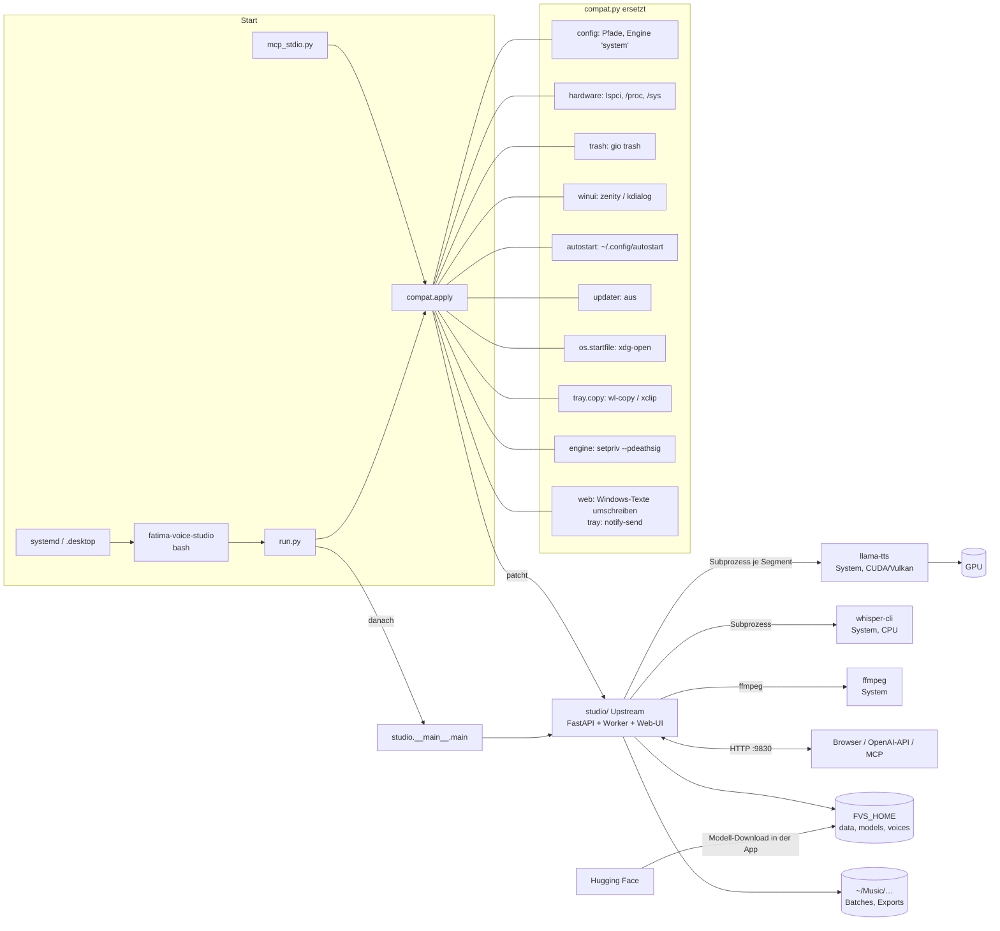

# Architektur der Linux-Anpassung

Prinzip: `studio/` (Upstream) wird nicht verändert. `run.py` ruft `compat.apply()` auf, **bevor** `studio`
importiert wird; `compat.py` ersetzt zur Laufzeit die Windows-Teile. Danach läuft der normale Einstieg
`studio.__main__.main()`.

## Ablauf beim Start

1. `run.py` setzt den Importpfad und importiert `compat`.
2. `compat.apply()`:
   1. importiert `studio.config` und biegt Pfade, Standardwerte und Engine-Funktionen um,
   3. ersetzt `studio.trash` und `studio.winui` durch Linux-Module (`sys.modules`),
   4. überschreibt die Hardware-Erkennung (`import winreg` in `studio/hardware.py` wird nur für diesen einen Import
      mit einem Stub bedient; bliebe er in `sys.modules`, hielte `mimetypes` das System für Windows), Autostart-Funktionen und den Updater,
   5. legt die Symlinks `engine/system/llama-tts` und `engine/whisper/whisper-cli` an.
3. `studio.__main__.main()` startet uvicorn wie unter Windows.

Reihenfolge ist wichtig: Module wie `presets`, `voices`, `speech_text` lesen `config.DATA`/`config.VOICES` schon als
Standardargument beim Import. `config` muss deshalb vor allen anderen gepatcht sein.

## Engine „system“

Upstream erwartet `<engine_dir>/<ENGINE_EXE>` und lädt Windows-ZIPs herunter. Unter Linux gibt es eine einzige
Engine `system` ohne Downloads (`zips: []`). `engine_dir()` zeigt auf `FVS_HOME/engine/system`, darin liegt ein
Symlink auf das `llama-tts` aus dem `PATH` (oder `FVS_LLAMA_TTS`). Dasselbe gilt für `whisper-cli`. So bleibt
der Upstream-Code für Start, Fortschritt und Fehlermeldungen unverändert.

## Was nicht ersetzt wurde (und warum es geht)

- `creationflags=CREATE_NO_WINDOW`: Upstream nutzt `getattr(subprocess, …, 0)`, unter Linux also 0.
- `_KillOnCloseJob` (Windows Job Object): nur bei `sys.platform == "win32"`. Unter Linux ersetzt
  `compat._patch_engine` das: `engine.subprocess.Popen` startet `llama-tts` über `setpriv --pdeathsig SIGKILL`,
  der Kernel beendet die Engine also mit der App (`setpriv` ersetzt sich per exec, die PID bleibt gleich).
- ffmpeg: Upstream sucht erst die eigene `ffmpeg.exe`, dann `shutil.which("ffmpeg")`.
