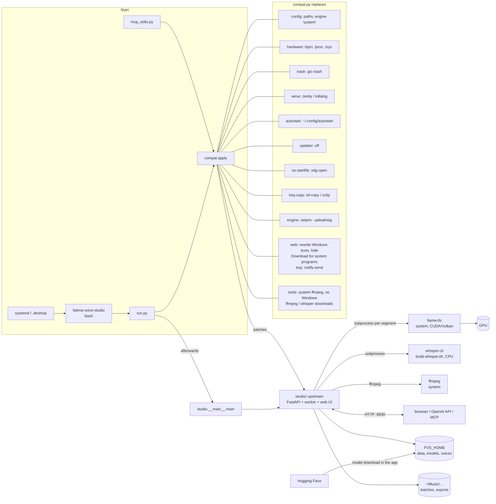

# Architecture of the Linux adaptation

Principle: `studio/` (upstream) is not modified. `run.py` calls `compat.apply()` **before** `studio` is imported;
`compat.py` replaces the Windows-specific parts at runtime. After that the normal entry point
`studio.__main__.main()` runs.

## What happens at startup

1. `run.py` sets the import path and imports `compat`.
2. `compat.apply()`:
   1. imports `studio.config` and redirects paths, defaults and the engine functions,
   2. replaces `studio.trash` and `studio.winui` with Linux modules (`sys.modules`),
   3. overrides the hardware detection (`import winreg` in `studio/hardware.py` is served with a stub for that one
      import only; if it stayed in `sys.modules`, `mimetypes` would take the system for Windows), then the
      tools (ffmpeg, Whisper, engine downloads, see below), the autostart functions and the updater,
   4. creates the symlinks `engine/system/llama-tts` and `engine/whisper/whisper-cli`.
3. `studio.__main__.main()` starts uvicorn as on Windows.

The order matters: modules such as `presets`, `voices` and `speech_text` read `config.DATA`/`config.VOICES` as default
arguments at import time, so `config` has to be patched before all of them.

## Engine "system"

Upstream expects `<engine_dir>/<ENGINE_EXE>` and downloads Windows zips. On Linux there is a single engine,
`system`, without downloads (`zips: []`). `engine_dir()` points to `FVS_HOME/engine/system`, which holds a symlink to
the `llama-tts` from `PATH` (or `FVS_LLAMA_TTS`). The same goes for `whisper-cli`. This keeps the upstream code for
starting, progress and error messages unchanged.

Because there is nothing to download, the Setup page must not offer a Download button for it, and a direct request
must not end in a made-up download error. `compat._patch_tools` therefore makes `Downloads.start_engine` answer
"nothing to download, install llama.cpp and press Check again" for engines without zips, and two small edits of
`app.js` (`JS_PATCHES`) show "Not found on this PC" instead of the button.

## ffmpeg and Whisper: system programs, not downloads

Upstream downloads Windows builds of both and prefers its own copy:

- **ffmpeg.** `config.TOOLS` points at a Windows zip, and `media.ffmpeg_exe()` prefers `engine/ffmpeg/ffmpeg.exe`
  over `shutil.which("ffmpeg")`. On Linux that would install a program that cannot run and then hide the real ffmpeg.
  `_patch_tools` replaces `media.ffmpeg_exe`/`ffmpeg_source` (only the system ffmpeg counts; a stray `ffmpeg.exe` is
  ignored), turns `config.TOOLS` into a single entry without a zip, and makes `Downloads.tools`/`start_tool`/
  `delete_tool` report it as a system program. The Models page shows how to install ffmpeg; a request to download it
  gets a 409 with the same advice. Error messages that point to "the Models page (Tools)" are reworded (`TEXTS`).
- **Whisper.** A Whisper *model* is downloaded as usual, but `Downloads._whisper_missing` returns `False`, so the
  Windows `whisper-bin-x64.zip` is never requested (it would end in "The download doesn't contain whisper-cli").
  `whisper-cli` comes from `build-whisper.sh`; the Whisper model descriptions say so, and `hardware.warnings` adds a
  Setup warning while a Whisper model is installed but `whisper-cli` is not found.

## What was not replaced (and why that works)

- `creationflags=CREATE_NO_WINDOW`: upstream uses `getattr(subprocess, …, 0)`, which is 0 on Linux.
- `_KillOnCloseJob` (Windows job object): only used when `sys.platform == "win32"`. On Linux `compat._patch_engine`
  replaces it: `engine.subprocess.Popen` starts `llama-tts` through `setpriv --pdeathsig SIGKILL`, so the kernel ends
  the engine together with the app (`setpriv` replaces itself via exec, the PID stays the same). `whisper-cli` is not
  started that way; it is short-lived.
- `runtime.prepare()` (Visual C++ runtime DLLs, upstream 0.2.4): returns immediately when `runtime/` doesn't exist,
  which is the case in a source checkout.
- Install paths with spaces: the `Exec=` line of the autostart entry is built by `compat.exec_quote`; `setup.sh` uses
  the same function for the menu entry and a matching quoting function for the systemd unit, and fills the templates
  in `desktop/` and `systemd/` without `sed` (an install path may contain `&` or `\`).
