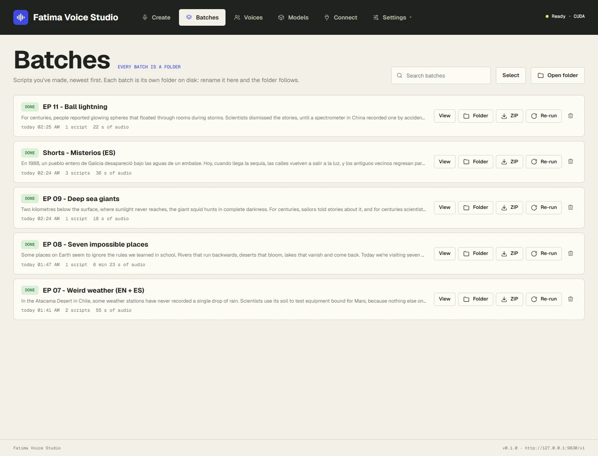
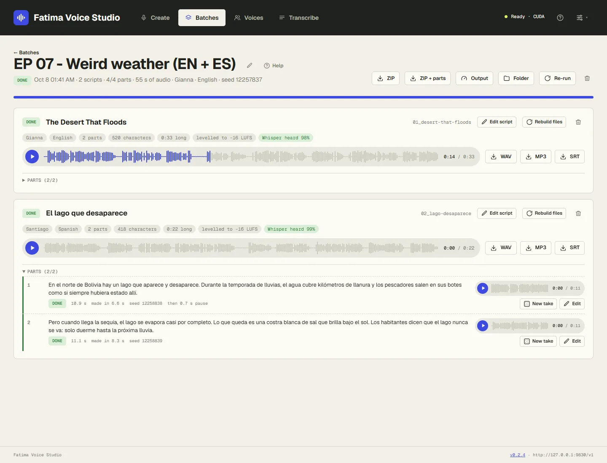

# Batches and fixing parts

Every batch is a folder on your PC, and the **Batches** page lists them all, newest first. Quick takes are here
too, in one *Singles* batch per day.

## The Batches page

- **Search batches** — by name or by the first words of the script.
- **View** — open the batch's page (or click its name).
- **Folder** — open the batch's folder in File Explorer.
- **ZIP** — download the finished files as one ZIP.
- **Re-run** — make the batch again as a new batch, with the same seeds, so you get the same takes. Useful after
  changing your pronunciation list.
- **Delete** (bin icon) — the folder goes to the Windows Recycle Bin, so you can restore it from there.
- **Select** — tick several batches and **Delete selected** at once. Batches still working can't be selected.
- **Open folder** — the folder that holds all your batches.

### What the labels mean

| Label | Meaning |
|---|---|
| **Speaking** | Being spoken right now. |
| **Queued** / **Waiting** | Waiting for its turn. |
| **Finishing** | All parts are spoken; the files and subtitles are being written. |
| **Paused** | You paused it. Click **Resume** to carry on. |
| **Done** | Finished. |
| **Needs attention** | A part failed. Open the batch and click **Retry**. |
| **Cancelled** | You stopped it. Finished scripts are kept. |

*Parts to check* in amber means some parts may sound wrong; see [Checks](#checks-parts-worth-a-listen).

## A batch's page

At the top: the name (click the pencil to **rename** it; the folder is renamed too), the status, and how far along
it is. The buttons:

- **Pause** / **Resume** — pausing lets the current part finish, then stops.
- **Stop** — cancels the parts not spoken yet. Finished scripts are kept, and **Retry** carries on later.
- **Retry** — speaks failed or cancelled parts again.
- **ZIP** — the finished files. **ZIP + parts** — the finished files plus every part on its own.
- **Output** — change speed, loudness and files afterwards (see below).
- **Folder**, **Re-run**, and **Delete** (bin icon, only when the batch isn't working).

Below, each script has its own card: a player for the finished voiceover (click or drag on its waveform to jump
to any moment; only one player plays at a time), buttons to download its **WAV**, **MP3**
and **SRT**, and details: its voice and language, how many parts, its length, the loudness, and
**Whisper heard 98%**: how many of the script's words Whisper recognised in the audio. Close to 100% is good.

On each script card:

- **Edit script** — see [Edit a finished script](#edit-a-finished-script).
- **Rebuild files** — make the WAV, MP3 and SRT again from the parts.
- **Delete** (bin icon) — removes that script; its files go to the Recycle Bin. A batch's only script can't be
  deleted: delete the batch instead.

## Fixing one part

Open **Parts** under a script to see every part: its text, a player, its length and its seed. If the voice reads
a part differently from your text (because of numbers or your pronunciation list), a **Read as:** line shows what
it actually read.

- **New take** — speaks this part again with a new seed: a different reading of the same text. Try it when a
  part sounds odd, rushed or flat.
- **Edit** — change the part's text: fix a word, spell a name the way it sounds, add a comma for a pause. Click
  **Save and speak again**.
- **Retry** — for a part that failed.

The script's WAV, MP3 and SRT are **rebuilt by themselves** when the part is done. Nothing else is spoken again.

## Edit a finished script

Click **Edit script** on a script card to change its text, title, voice or language.

- Changing the **text**: only the parts whose text changed are spoken again; the rest keep their audio.
- Changing the **voice** or **language**: the whole script is spoken again.

A script can't be edited while one of its parts is being spoken: pause the batch, wait for the part to finish,
then edit.

## Change speed, loudness or files afterwards

Click **Output** at the top of the batch (or on a Quick take's card) to change the **speed**, the **loudness**,
and which files are made (WAV, MP3, SRT). Click **Rebuild files**: every finished script is rebuilt in a few
seconds. Nothing is spoken again, so the voice and the takes stay exactly the same.

## Checks: parts worth a listen

The app listens to its own work:

- A part that came out **far too long** (the voice may have repeated or rambled) or **far too short** (it may have
  skipped words) is made again once, automatically. If it still looks wrong, it's marked.
- When the subtitles are made, Whisper listens to every part. A part where it recognised **under 70% of the
  words** is marked as worth a listen.

Marked parts are highlighted with a note. Listen to them; if one is wrong, give it a **New take** or **Edit** it.
Often it's fine (an unusual name Whisper didn't know, for example).

## If the PC or the app stops

If the app closes or the PC restarts in the middle of a batch, the batch carries on where it left off the next
time the app starts. Parts already spoken are kept.

## Next

- [Files and folders](files-and-folders.md): what's inside a batch's folder.
- [Troubleshooting](troubleshooting.md)
