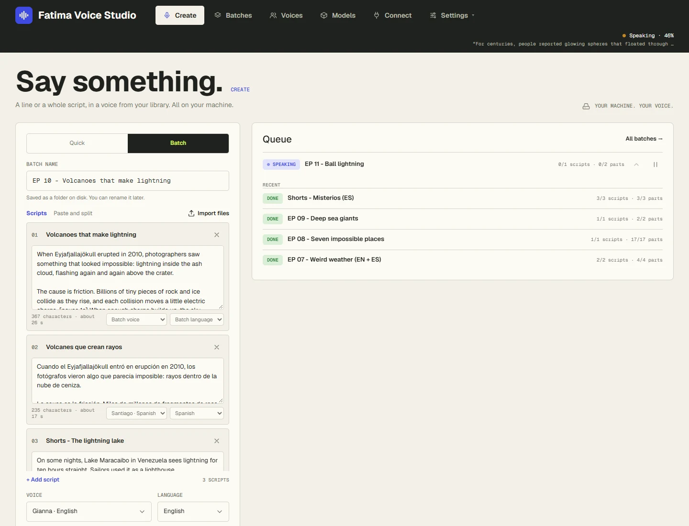

# Making voiceovers

Everything is made on the **Create** page. It has two modes at the top of the card: **Quick** for one piece of
text right now, and **Batch** for one or many full scripts.



What you type is kept while you work: if you close the page or the browser, it's still there when you come back.

## Quick takes

For a line, an intro, a correction, or trying a voice.

1. Click **Quick**.
2. Type or paste the text.
3. Pick the **Voice** and **Language**.
4. Click **Make it**, or press **Ctrl+Enter**.

Quick takes go **ahead of any batch** that's running, so you don't wait for the queue. The take appears on the
right and plays by itself. Under it:

- **WAV / MP3 / SRT** — download the files.
- **Another take** — the same text with a new random seed, for a different reading.
- **Open in Batches** — every Quick take is saved in one folder per day, named like `2026-10-09_Singles`.

## Batches

For full scripts: one 20-minute episode, or fifty short ones.

1. Click **Batch**.
2. Give it a **Batch name**, or leave it empty for the date and the first words. The name is also the folder's
   name on disk; you can rename it later.
3. Add your scripts, in any of the three ways below.
4. Pick the **Voice** and **Language** for the batch.
5. Click **Start batch**.

The batch's own page opens and you can watch it being spoken part by part. You can leave the page, start more
batches (they wait in the queue), or close the browser: the app keeps working in the background.

### Three ways to add scripts

- **Scripts** — type or paste each script in its own box. Click **+ Add script** for another. The title is
  optional; without one, the first words are used. Each box shows how long the script is and about how long it
  will sound.
- **Paste and split** — paste many scripts at once. Start each one with a title line like `### Episode 12`, or put
  a line of `---` between them. The app shows how many scripts it found; click **Use these scripts**.
- **Import files** — choose one or more files:
    - each **.txt** or **.md** file becomes one script, titled with the file name;
    - a **.csv** file (from Excel or Google Sheets) has one script per row, with a `text` column and, if you like,
    `title`, `voice` and `language` columns.

Example of *Paste and split*:

```
### The lost city
It was the summer of 1911 when the expedition finally reached the ridge...

### The second expedition
Four years later, they went back...
```

### A different voice or language per script

Under each script are two small menus: **Batch voice** and **Batch language**. Leave them alone to use the batch's
voice and language, or pick another for that script only. Picking a voice also picks its language.

## The estimate

Above the button, a line tells you what you're about to make: how many scripts and **parts** (long scripts are
spoken in parts of about 40 seconds), about how long the audio will be, and about how long it will take. Run the
speed test on the Setup page once to make this estimate fit your PC.

## Output and pauses

Click **Output and pauses** to open the other options. Their starting values come from
[Settings](settings.md), and a [channel preset](#channel-presets) can fill them in for you.

| Option | What it does |
|---|---|
| **Files** | WAV, MP3, and **Subtitles (SRT)**. At least one of WAV or MP3. Subtitles need a Whisper model. |
| **Speed** | 0.85× (slower) to 1.2× (faster). Changes the pace, not the pitch of the voice. |
| **Say numbers as words** | Reads 1913, $5M, 35% and 5:30 as words. English, Spanish, French, German, Italian and Portuguese. |
| **See what the voice will read** | Shows your text exactly as the voice will read it: numbers in words, your pronunciation list applied. |
| **Loudness** | How loud the finished file is. *Voiceover · −16 LUFS* is recommended for YouTube voiceovers. |
| **Pause between paragraphs** | Silence at each blank line, in seconds. 0.7 s by default. |
| **Seed** | Leave empty for a random one. The same seed, voice and text give the same take again. |
| **Voice model** | The model that speaks, with its licence. *Commercial use OK* means you can use the audio in monetized videos. |

Speed, loudness and the files can be changed after a batch is finished, without speaking it again: see
[Batches and fixing parts](batches.md#change-speed-loudness-or-files-afterwards).

### Loudness, briefly

Loudness is measured in LUFS; closer to zero is louder. The choices:

- **−14** — the level YouTube plays music at. Loud.
- **−16** — voiceover level. Recommended: it sits well under music and matches most YouTube voiceovers.
- **−19** — podcasts, a bit quieter.
- **−23** — broadcast TV.

Peaks are always kept under −1 dB, so the files never clip.

## Channel presets

A preset saves the voice, language, model, speed, loudness, pauses, files and the numbers option under one name,
like your channel's. Then one click sets them all.

- **Save a preset:** set everything up, click **Save** next to *Channel preset*, type a name, and click **Save**.
- **Use it:** pick it in the *Channel preset* menu.
- **Update it:** pick it, change what you want, click **Save** and keep the same name.
- **Delete it:** pick it and click the bin icon. Voices and batches aren't touched.

AI agents can use your presets by name too (see [Connect](connect.md)).

## The queue

The **Queue** card on the right of the Create page shows batches waiting or being spoken, with:

- the arrow to **move a batch up** the queue,
- **pause** and **resume**,
- how many parts are done and about how long is left.

Batches are spoken one part at a time, in queue order. Below the queue are your most recent batches.
At the top, three tiles show how much audio you made **today**, **this week** (since Monday) and **in all**.

## Next

- [Writing scripts for the voice](writing-scripts.md)
- [Batches and fixing parts](batches.md)
