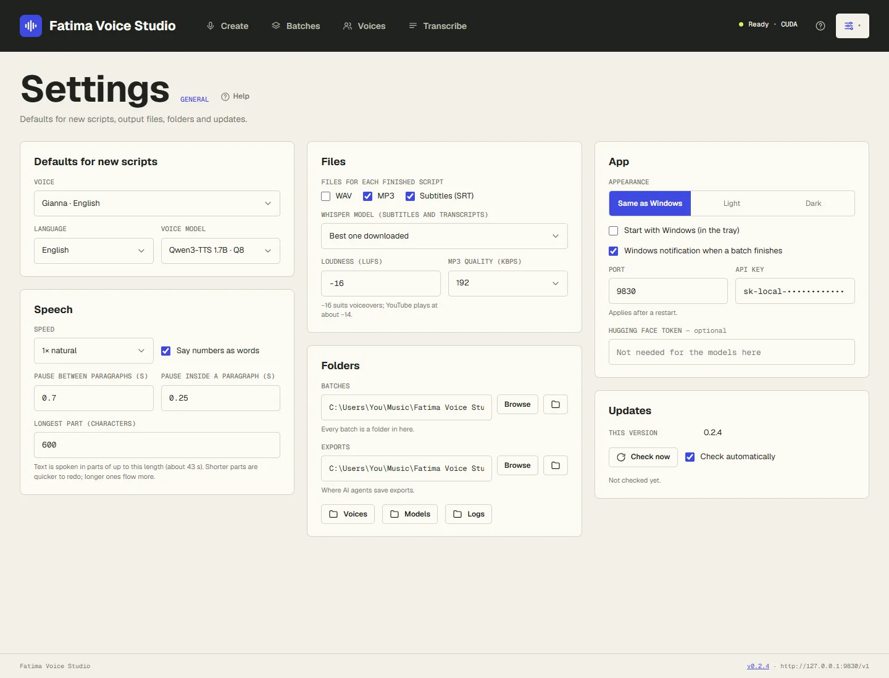

# Settings

Open the menu button at the top right (the sliders icon, next to **?**). Its menu has **Settings** (this page), **Pronunciation** (see
[Pronunciation](pronunciation.md)), **Models** and **Setup** (see [Setup and models](setup-and-models.md)),
**Connect** (see [Connect](connect.md)) and **About**: the version, the licences, and your PC's details to copy
into a problem report.

Every change on the Settings page is saved as soon as you make it.

## Defaults for new scripts

| Setting | What it does | Default |
|---|---|---|
| **Voice** | The voice picked for you on the Create page. Same as *Make default* (the star) on a voice's card. | your first voice |
| **Language** | The language picked when the voice doesn't set one. | English |
| **Voice model** | The model that speaks new scripts. | Qwen3-TTS 1.7B · Q8 |

## Speech

| Setting | What it does | Default |
|---|---|---|
| **Speed** | 0.85× to 1.2×. Faster or slower speech with the same pitch. | 1× |
| **Say numbers as words** | Reads 1913, $5M, 35%, 5:30 as words. See [Writing scripts](writing-scripts.md#numbers-money-dates). | on |
| **Pause between paragraphs** | Seconds of silence at each blank line in a script. | 0.7 s |
| **Pause inside a paragraph** | Seconds of silence where a long paragraph is split into parts. | 0.25 s |
| **Longest part** | The most text spoken at once, in characters (150–1200). Shorter parts are quicker to redo; longer ones flow more. | 600 (about 40 s) |

## Files

| Setting | What it does | Default |
|---|---|---|
| **Files for each finished script** | WAV, MP3 and Subtitles (SRT). | all three |
| **Whisper model** | Which Whisper times subtitles and makes transcripts. *Best one downloaded* picks the most accurate you have. With a graphics card engine it runs on the card, where large-v3 turbo is the best pick; on the processor, small is quicker. | Best one downloaded |
| **Loudness (LUFS)** | How loud finished files are. −16 suits voiceovers; YouTube plays at about −14. | −16 |
| **MP3 quality (kbps)** | Higher is better and bigger. 192 is very good for voice. | 192 |

The Create page starts from these values, and you can change them for each batch there. Batches already made keep
their own; change those with the **Output** button on the batch (see
[Batches](batches.md#change-speed-loudness-or-files-afterwards)).

## Folders

- **Batches** — where every batch's folder goes. **Browse** to choose another folder; the folder icon opens it in
  File Explorer. Running batches must finish (or be cancelled) before you move it.
- **Exports** — where AI agents save the exports they make.
- **Voices**, **Models**, **Logs** — open those folders.

See [Files and folders](files-and-folders.md).

## App

| Setting | What it does | Default |
|---|---|---|
| **Appearance** | Light or dark pages, or **Same as Windows** to follow your Windows colour setting. Kept in this browser only. | Same as Windows |
| **Start with Windows (in the tray)** | Starts the app quietly when you sign in to Windows. Also in the tray menu. | off |
| **Windows notification when a batch finishes** | A Windows notification when a batch is done. | on |
| **Port** | The address the studio uses: `http://127.0.0.1:<port>/`. Change it only if another program uses 9830. Applies after a restart. | 9830 |
| **API key** | The password other apps and AI agents use (see [Connect](connect.md)). At least 8 characters, no spaces. Change it if it was shared by mistake; then update your apps and agents. | made at first start |
| **Hugging Face token** | Not needed for any model the app offers today. | empty |

## Updates

Shows your version, and new versions when they're out: what's new, how big the download is, and the **Quick
update** and **Full update** buttons. **Check now** checks right away; **Check automatically** checks when the app
starts and every 6 hours. See [Updates and uninstalling](updates.md).
