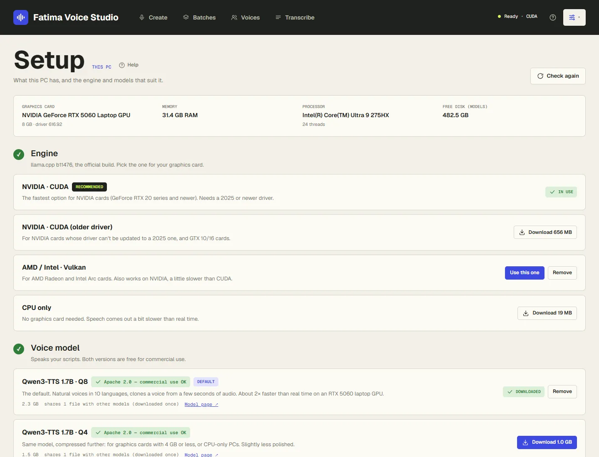

# Setup and models

The app itself is small. The parts that do the work are downloaded once, on the **Setup** and **Models** pages,
and then run offline. Both are in the menu button at the top right (the sliders icon, next to **?**).

## The Setup page

Setup shows what your PC has (graphics card and its memory, RAM, processor, free disk) and warns you about
anything that matters, like an NVIDIA driver that's too old. Then it walks through five steps, with the choices
that suit your PC marked **Recommended**:

1. **Engine** — the program that runs the voice model.
2. **Voice model** — speaks your scripts.
3. **Subtitles** (recommended) — the Whisper model that times your subtitles.
4. **A voice** — a link to the Voices page.
5. **Speed test** — speaks a short paragraph and measures how fast your PC is.

Click **Check again** after changing something on your PC (a new driver, for example).

## Engines

The engine is the official [llama.cpp](https://github.com/ggml-org/llama.cpp) build for your kind of graphics card.
You need one; you can download others and switch with **Use this one**.

| Engine | For | Download |
|---|---|---|
| **NVIDIA · CUDA** | NVIDIA GeForce RTX 20 series and newer, with a 2025 or newer driver. The fastest. | about 580 MB |
| **NVIDIA · CUDA (older driver)** | NVIDIA cards whose driver can't be updated, and GTX 10 and 16 series. | about 660 MB |
| **AMD / Intel · Vulkan** | AMD Radeon and Intel Arc cards. Also works on NVIDIA, a little slower. | about 33 MB |
| **CPU only** | PCs without a graphics card. Slower than real time. | about 19 MB |

If the recommended NVIDIA engine won't start, update your graphics driver from nvidia.com or the NVIDIA app, or use
*NVIDIA · CUDA (older driver)*.

## Voice models

| Model | For | Download |
|---|---|---|
| **Qwen3-TTS 1.7B · Q8** (default) | The best quality. Graphics cards with more than 4 GB. | 2.3 GB |
| **Qwen3-TTS 1.7B · Q4** | Graphics cards with 4 GB or less, and CPU-only PCs. | 1.5 GB |

Both are the same model ([Qwen3-TTS](https://huggingface.co/Qwen/Qwen3-TTS-12Hz-1.7B-Base)), free for
commercial use (Apache 2.0), and speak 10 languages: English, Spanish, French, German, Italian, Portuguese,
Russian, Japanese, Korean and Chinese. The Models page warns when a model is a tight fit or too big for your
graphics card.

## Whisper models (subtitles and transcripts)

Whisper listens to the finished audio to time the subtitles, checks that every part was read, and powers the
[Transcribe](transcribe.md) page. It runs on the processor, not the graphics card.

| Model | Notes | Download |
|---|---|---|
| **Whisper base** | The smallest and quickest. | 60 MB |
| **Whisper small** | Recommended for subtitles. About 10× faster than real time. | 190 MB |
| **Whisper medium** | More accurate, especially in Spanish and other non-English languages. | 539 MB |
| **Whisper large-v3 turbo** | Close to the best accuracy, much quicker than large-v3. Good for transcribing other people's audio. | 574 MB |
| **Whisper large-v3** | The most accurate, and the slowest. For hard audio: accents, noise, music underneath. | 1.1 GB |

When you have more than one, choose which one is used with **Use this one** on the Models page, or in
**Settings → Files**. Your subtitles always use your script's own words; Whisper only times them, so *small* is
plenty for subtitles.

## Voice separator

*Voice separator (UVR MDX-Net)*, 67 MB: takes a voice out of music or background sound when you
[add a voice](voices.md#take-the-voice-out-of-music-or-background-sound) from a video or song. Runs on the
processor, about 4× faster than real time.

## Tools: ffmpeg

*ffmpeg* lets the app read video files (MP4, MKV, MOV, WEBM…) for transcripts and voice clips. If it's already
installed on your PC, the app uses that one and says *Already on this PC*. Otherwise, download it (115 MB) on the
Models page, under *Tools*. It's a separate program under the GPL licence; using it doesn't affect your audio.

## Downloading, pausing, removing

- **Download** — shows the size. A progress bar follows it, and you can leave the page.
- **Pause** — stops a download; **Resume** carries on from where it stopped. **Discard** deletes the part
  downloaded.
- Every download is checked against its known checksum when it finishes.
- **Remove** — deletes a model or engine from your PC. You can download it again any time. The default voice model
  and the engine in use can't be removed until you choose another.

Models come from Hugging Face and engines from GitHub. Nothing else is downloaded without you clicking a button.

## Licences

Every model shows its licence. **Commercial use OK** (green) means you can use the audio in monetized videos and
client work. Everything the app offers today is commercial-use OK. A non-commercial model would carry a red label,
and AI agents couldn't use it unless you allow it on the Connect page. The full list is in
[THIRD_PARTY_NOTICES.md](https://github.com/hassanxs/fatima-voice-studio/blob/main/THIRD_PARTY_NOTICES.md).

## The speed test

**Run speed test** speaks a short paragraph (about 20 seconds) and shows how many times faster than real time your
PC speaks, and about how long a 10-minute script takes. The Create page uses it for its estimates. Run it again
after changing the engine or the model. It can't run while batches are speaking.

Typical results: a laptop RTX 5060 speaks about 2.2× faster than real time; a PC without a graphics card about
0.7×.
